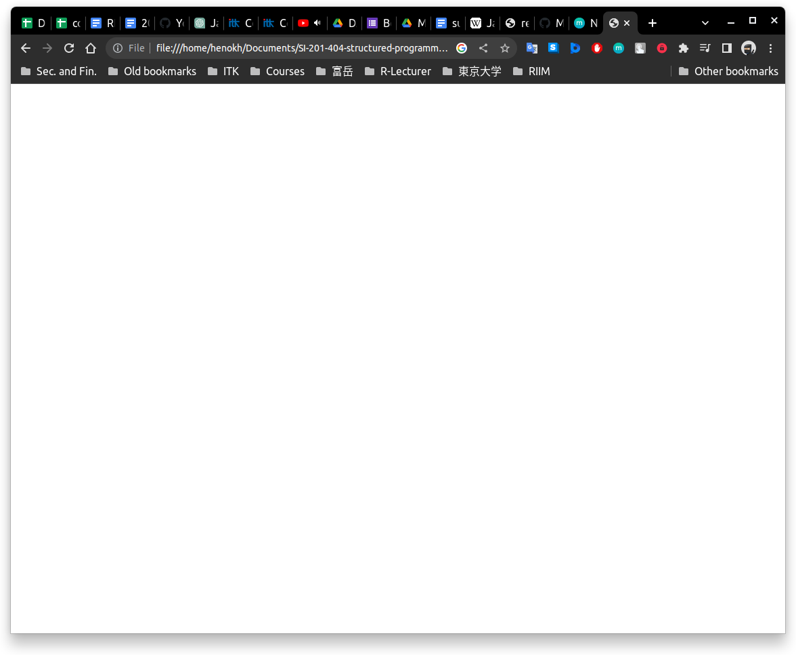
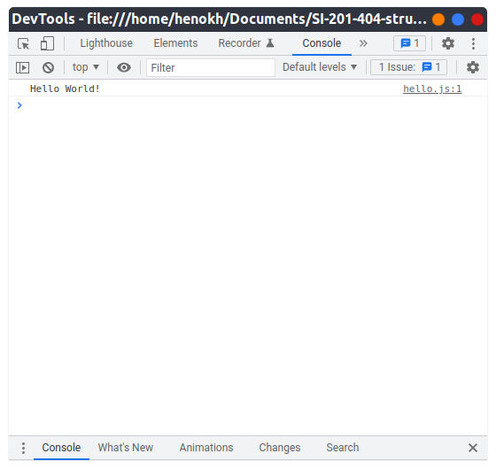
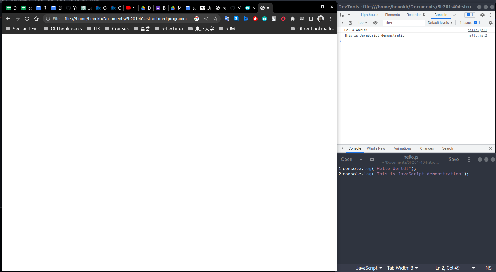
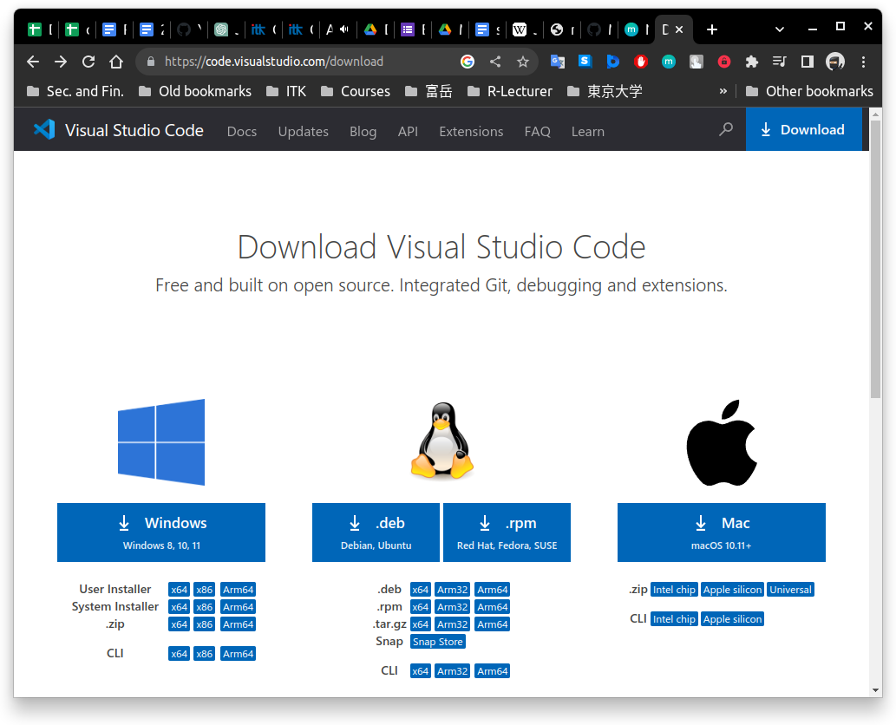

# Modul praktikum - Minggu 01 - Pengantar

Dosen pengampu: **Henokh Lugo Hariyanto**  
Asisten mata kuliah: **Feriyanto - (10191031)**

**Tujuan**: 
- Mampu menjalankan program JavaScript di *browser* maupun di Node.js.
- Mampu menuliskan laporan sederhana menggunakan *markdown*.

Pada modul praktikum ini, kita akan mempelajari sedikit tentang JavaScript, 
menjalankan program sederhana di *Web Browser*, instalasi VSCode, instalasi
Node.js, menjalankan kode JavaScript di Node.js. 

> Tips belajar bahasa pemrograman adalah mengetik ulang perintah yang kita 
> temukan di buku atau di internet, lalu kita ubah-ubah untuk menguji pemahaman
> kita sudah tepat atau belum. Faktor bermain-main dan eksplorasi sangat 
> diperlukan untuk memahami setiap perintah bahasa pemrograman yang kita pelajari.

## Sedikit hal tentang JavaScript

Bagian ini hanya menambahkan sedikit yang akan (sudah?) dijelaskan dalam kuliah.  
JavaScript bermula dari pengembangan *web browser* Netscape Navigator. 
Dalam rilis Navigator tahun 1995, Brendan Eich mengembangkan bahasa pemrograman
JavaScript. *Web browser* sebelumnya masih sangat statis (tidak dapat 
menampilkan hal yang bergerak / animasi). Berikut sedikit gambaran web statis
sebelum JavaScript


## Menjalankan kode JavaScript di *Web Browser*

Berikutnya kita akan mencoba menjalankan kode JavaScript berikut
```js
  console.log("Hello world!");
```

Untuk dapat menjalankan perintah tersebut kita akan melalui berbagai tahapan
berikut:
1. Kita siapkan terlebih dahulu direktori untuk menampung semua berkas 
   JavaScript dan satu tambahan berkas HTML. Misal kita buat nama direktory
   `hello`. Di dalam direktori tersebut, kita isi berkas berekstensi
   JavaScript, `.js`, dengan nama `hello.js` yang berisikan kode
   JavaScript di atas. Untuk membuat kedua berkas tersebut dapat menggunakan
   *text editor* seperti Notepad, Notepad++, GEdit, atau VSCode (yang
   akan kita jelaskan di bagian berikutnya).
   
2. Berikutnya kita buat berkas HTML berekstensi `.html` dan berisi kode 
   HTML berikut:
    ```html
    <script src="hello.js"></script>
    ```
   Kita namakan berkas tersebut `hello.html`.

3. Setelah kedua berkas dibuat, buka *web browser* favorit kalian.
   Pada contoh ini, kita akan menggunakan Google Chrome *web browser*
   yang terpasang pada sistem operasi Linux. Buka halaman baru, 
   lalu tekan `Ctrl + O` untuk membuka berkas `hello.html`.
   Maka halaman baru tersebut hanya menampilkan halaman berwarna putih
   kosong   
   
   
4. Selanjutnya, tekan tombol `F12` untuk masuk ke jendela *Developer Tools*
   dari Google Chrome *web browser*. Maka akan muncul keluaran dari program
   yaitu menuliskan `"Hello World!"` pada bagian `console`   
   

5. Kita dapat mengubah-ubah isi dari `hello.js`, lalu kita perlu
   me-*refresh* halaman `hello.html` untuk melihat perubahan di jendela
   *console* Google Chrome. Pada tahap ini kita melihat bahwa sebenarnya
   *web browser* sudah memuat suatu program untuk menerjemahkan kode
   JavaScript tanpa perlu menginstal program tambahan
   

## Instalasi VSCode

Ada banyak tutorial di internet dan YouTube mengenai instalasi VSCode di 
Windows, Mac, dan Linux. Namun disini hanya disampaikan secara singkat 
instalasi VSCode.

1. Pertama-tama, unduh berkas *installer* di tautan berikut: 
   https://code.visualstudio.com/download.    
   Pilih sesuai dengan jenis sistem operasi yang kita miliki.   
   

2. Setelah itu jalankan *installer* Windows.

## Instalasi `Node.js`

Untuk `Node.js` yang digunakan adalah versi LTS (Long-Term Support) 18.13.0
yang ter-*update* sampai bulan Januari 2023. Versi `Node.js` ini harus
di-instal dengan versi NPM (Node Package Manager) yang bersesuaian 
yaitu versi 8.19.3.

Agar bisa menggunakan berbagai versi `Node.js`, maka diperlukan NVM 
(Node Version Manager). Versi yang akan kita gunakan adalah versi 0.39.3
yang ter-*update* hingga Januari 2023.

Tahapan instalasi `Node.js` untuk Window tidak sederhana, namun panduannya bisa
diikuti dari [NVM for Windows](https://github.com/coreybutler/nvm-windows/wiki#manual-installation). Perlu diingat NVM for Windows sangat berbeda dengan
NVM yang ada untuk Mac dan Linux.

Untuk tahapa

## Menjalankan kode JavaScript di Node.js

## Tugas
> Laporan harus ditulis dan dikumpulkan dalam bentuk berkas 
> *markdown* atau berkas berekstensi `.md`. Apabila laporan memuat lebih 
> dari satu berkas, misal memuat berkas gambar `.png` atau `.jpg`, maka
> berkas disatukan menjadi berkas `.zip`.   
> **PASTIKAN** berkas `md` sudah dilakukan *preview*, sehingga kode *markdown*
> bisa di-*preview* dengan benar.  
> Format penamaan file: `NIM_NAMA.md` atau `NIM_NAMA.zip` (boleh nama
> lengkap atau nama panggilan.

1. Tuliskan pengalaman belajar mulai dari awal praktikum hingga praktikum 
   selesai. Bisa menyertakanan *screenshot*, atau potongan kode selama
   praktikum.
2. Berikan kelebihan dan kekurangan menggunakan *browser* dan *Node.js*.
3. Jalankan program berikut melalui *Node.js*.  
    ```js
    let randomQuote;
    const quotes = [
      "The best way to predict the future is to create it.",
      "Be the change you wish to see in the world.",
      "Innovation distinguishes between a leader and a follower.",
      "Believe you can and you're halfway there.",
      "Your time is limited, don't waste it living someone else's life."];

    randomQuote = quotes[Math.floor(Math.random() * quotes.length)];
    console.log(randomQuote);
    ``` 
    Selanjutnya apakah yang terjadi jika secara terus menerus hanya menjalankan dua baris
    terakhir?