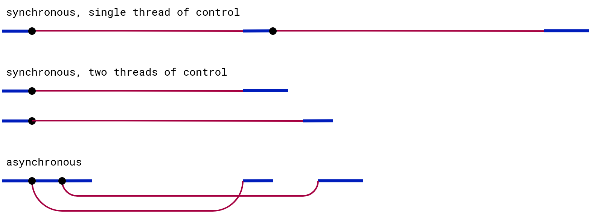

# Modul praktikum - Minggu 12 - *Asynchronous Programming in JavaScript* (bagian 1)

Dosen pengampu: **Henokh Lugo Hariyanto**  
Asisten mata kuliah: **Dahayu Azhka Daeshawnda - (10231027)**; **Dyno Fadhillah Ramadhani- (10231033)**

**Tujuan**:
- Mampu mengerti gagasan dasar *asynchronous programming*

> Tips belajar bahasa pemrograman adalah mengetik ulang perintah yang kita 
> temukan di buku atau di internet, lalu kita ubah-ubah untuk menguji pemahaman
> kita sudah tepat atau belum. Faktor bermain-main dan eksplorasi sangat 
> diperlukan untuk memahami setiap perintah bahasa pemrograman yang kita pelajari.
> Setiap potongan kode di bawah dapat ditulis dalam berkas `.js` lalu
> dapat di-*running* dengan Node.js.

Dalam pertemuan ini akan dibagi dua tahap, tahap pertama adalah mengenal 
pemrograman asinkronus yang merupakan fitur utama dari bahasa pemrograman
JavaScript dan juga pengenalan mengenai Promise object.

Di tahap kedua (praktikum minggu depan), kita akan melihat lebih dalam 
terkait objek Promise ini dan juga pengunaan await expression dan 
async Function.

Di tahap pertama ini kita akan membahas dua hal berikut:
- Mengenal pemrograman asinkronus    
- Contoh program asinkronus sederhana


## Mengenal pemrograman asinkronus

Sebelum mengerti asinkronus, kita harus mengerti bahwa pemroograman sinkronus
adalah semua progran yang telah kita pelajari di bagian sebelumnya
yaitu saat setiap perintah-perintah (statements) dieksekusi secara berurutan, 
setiap perintah akan dieksekusi setelah perintah yang dipanggil (umumnya di baris
sebelumnya) telah selesai dijalankan.

Program asinkronus merupakan program yang dapat berjalan tanpa harus menunggu
program lain selesai melakukan proses eksekusinya. Misal ada dua program 
yang satu melakukan download lagu, dan yang lain memutar file MP3. Atau 
saat kalian membuka aplikasi Instagram, kalian juga menerima notifikasi pesan 
masuk dari aplikasi WhatsApp. Bisa dikatakan
hampir semua aplikasi yang ada di laptop/PC atau *smartphone* yang kita 
gunakan berbasis pada pemrograman asinkronus.

Detail pemrograman asinkronus ini bekerja pada level prosesor bukanlah 
menjadi persoalan yang kita harus pelajari. Namun tata cara menggunakan
fitur pemrograman asinkronus di JavaScript adalah yang sangat perlu kita pelajari.

Berikut sedikit ilustrasi perbandingan pemrograman sinkronus dan 
asinkronus menurut (Haverbeke, 2018)



Dari gambar di atas terdapat istilah *threads* yang merupakan potongan
kode yang dijalankan pada suatu proses dalam suatu prosesor. Prosesor 
menjalankan proses besar yang terdiri dari beberapa *threads*. Seperti
sistem operasi merupakan proses besar yang terdiri dari potongan program
program kecil untuk mengatur hubungan antara *hardware* di dalam komputer 
dan sistem I/O 
(input/output termasuk monitor, keyboard, dan mouse)

Program-program yang kita buat di dalam Node.js dijalankan oleh *thread* ini.

Garis biru menunjukkan perjalanan waktu saat suatu program dieksekusi.
Garis merah adalah ketika program melakukan suatu *request* ke server.
Ketika kita menggunakan pemrograman sinkronus, kita harus menunggu program
pertama selesai melakukan *request*, baru kita bisa menjalankan program kedua.

Jika kita lakukan dengan dua *threads*, kita tidak bisa mengkomunikasikan
antara dua program ini misal program kedua akan melakukan instruksi kedua
(setelah program kedua melakukan *request*).

Namun dengan asinkronus, kita bisa membuat dua-duanya berjalan beriringan.
Dan ketika program pertama selesai melakukan *request* maka instruksi program
kedua bisa langsung dijalankan tanpa perlu melakukan *request* oleh program kedua
ini.

Bisa dikatakan, program pertama tetap berjalan di *background* sembari
kita bisa menjalankan program kedua. Kemampuan seperti ini sangatlah diperlukan
misal kita ingin menunggu input dari user dan melakukan suatu aksi ketika user
melakukan suatu input ke dalam program kita. Mirip seperti while loop
yang akan terhenti jika ada user input namun kita disini membiarkan 
program pertama terus berjalan.

## Contoh program asinkronus

Berikut ini adalah program yang menunjukkan penggunaan pemrograman asinkronus.
Terdapat istilah fungsi *callback* yang artinya fungsi ini akan menjadi suatu
argument untuk fungsi lain (sebut *parent* function). *Parent* function
ini akan berjalan di *background* (tetap dieksekusi) sampai suatu
*event* terjadi yang mengakibatkan fungsi *callback* dieksekusi atau 
lebih tepatnya dipanggil (*invoking*).

Pada program pertama ini, fungsi `setTimeout()` memerlukan dua input
argument. Pertama adalah *callback function* yang akan dipanggil setelah
jeda (*delay*) waktu pada input argument kedua selesai.
Pada contoh ini kita menginputkan argument *delay* sebanyak 2 detik. 
Input argument ini bersatuan *millisecond*, jadi kita inputkan 2 detik
sebagai 2,000 *milliseconds*.     

**timer-set-timeout.js**
```js
// Only run once after put a delay of 2 secons

console.log("delay two seconds from now");

const callbackFunc = () => {console.log("run after two seconds")};
setTimeout(callbackFunc, 2_000);
console.log("Do something during 2 secs");
```

Program kedua kita memiliki *nested callback function*. Artinya
*Callback function* di dalam *callback function* di dalam *callback function*,
dan seterusnya. Di program kedua ini, `callbackFunc()` merupakan 
*callback function* untuk `setInterval()` dan variable `updateInterval()`
yang merupakan referensi ke fungsi `setInterval()` menjadi bagian dari
*callback function* `stop_callbackFunc()`.
Dan terakhir `stop_callbackFunc()` merupakan argument fungsi `setTimeout()`.

**timer-set-interval.js**
```js
// The following program will print sequentially
// numbers from 1 to 10 with each one second delay

let state = {num: 0}

let callbackFunc = () => {
  state.num += 1;
  console.log(state.num)};

// Call callbackFunc in one second and then again repeat
// every second after that
let updateIntervalId = setInterval(callbackFunc, 1_000);


// setInterval() returns a value that we can use to stop the
// repeated invocations by calling clearInterval()

function stop_callbackFunc() {
  clearInterval(updateIntervalId);
}

setTimeout(stop_callbackFunc, 10_500);   // add a little bit milliseconds
                                         // from 10 secs.

```
Kita lihat disini kerumitan yang ditimbulkan dengan alur penggunaan  
*callback function* yang saling berkaitan. Kita akan melihat di 
bagian kedua bahwa hal ini dapat kita sederhanakan dan penulisan program
menjadi lebih elegan menggunakan objek *Promise*.


<br/>

Untuk contoh terakhir, program terdiri dari tiga berkas yaitu 
`events-demo.html`, `events-demo.css`, dan `events-demo.js`.
Program ini akan memberikan kita tampilan di berkas `.html`
berupa tombol untuk mengubah-ubah warna suatu teks.

Buat suatu folder bernama *events* dan taruh ketiga berkas tersebut
(`.html`, `.css`, dan `.js`) dalam folder tersebut.

**events-demo.html**
```html
<html>
  <head>
    <link rel="stylesheet" href="./events-demo.css"></style>
  </head>
  <body>
    <div id="output">
      <h3>Hello world!</h3>
    </div>
    <button id="change">Change color</button>

    <script src="./events-demo.js"></script>
  </body>
</html> 
```


**events-demo.css**
```css
.red {
  color: red;
}

.green {
  color: green;
}
```


**events-demo.js**
```js
function changeColor() {
  outElement = document.getElementById("output");
  // console.log(outElement.className);
  
  let currentClass = outElement.className;
  if (currentClass === "" || currentClass === "green") {
    outElement.className = "red";
  } else { 
    outElement.className = "green";
  } 
}

let btnChange = document.getElementById("change");

btnChange.addEventListener("click", changeColor);
```

## Tugas (Exercise - 09)
> Laporan harus ditulis dan dikumpulkan dalam bentuk berkas 
> *markdown* atau berkas berekstensi `.md`. Apabila laporan memuat lebih 
> dari satu berkas, misal memuat berkas gambar `.png` atau `.jpg`, maka
> berkas disatukan menjadi berkas `.zip`.   
> **PASTIKAN** berkas `md` sudah dilakukan *preview*, sehingga kode *markdown*
> bisa di-*preview* dengan benar.  
> Format penamaan file: `NIM_NAMA.md` atau `NIM_NAMA.zip` (boleh nama
> lengkap atau nama panggilan).
> 
> **Contoh format laporan atau jawaban (`NIM_NAMA.md`)**    
> Nama: [NAMA LENGKAP]   
> NIM: [NIM]
> 1. (Jawaban nomor 1)
> 2. (Jawaban nomor 2)


1. [30 poin] Bacalah topik mengenai pemrograman asinkronus di dalam 
   buku [(Haverbeke, 2018) - Bab 11](https://eloquentjavascript.net/11_async.html). 
   Jelaskan dan gambarkan keterkaitan hal apa saja yang telah kalian pahami
   di subbab *Asynchronicity*, *Crow Tech*, dan *Callbacks*. 
   Catatan: Jawaban setiap
   mahasiswa harus berbeda. Jawaban yang sama akan dibagi ke jumlah mahasiswa
   yang menjawab jawaban sama persis

2. [70 poin] Pelajari penggunaan Web API fetch dari blog berikut: 
   [JavaScript fetch API Ultimate Guide](https://blog.webdevsimplified.com/2022-01/js-fetch-api/)
   Tuliskan hal yang kalian benar-benar pahami.
   Dan tuliskan juga hal yang belum bisa kalian pahami dari tulisan dalam
   *blog* tersebut.