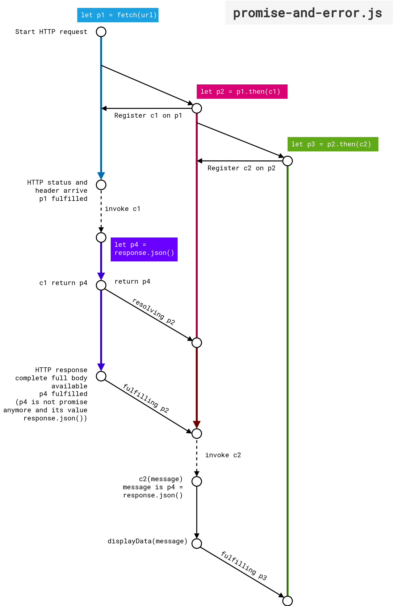
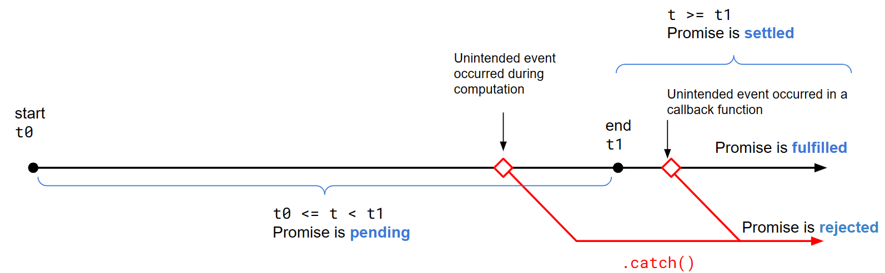

# Modul praktikum - Minggu 14 - *Asynchronous Programming in JavaScript* (bagian 2)

Dosen pengampu: **Henokh Lugo Hariyanto**  
Asisten mata kuliah: **Jein Ananda - (10221031)**; **Muhammad Aulia Rahman - (10221055)**

**Tujuan**:
- Mampu mengerti gagasan dasar *asynchronous programming*

> Tips belajar bahasa pemrograman adalah mengetik ulang perintah yang kita 
> temukan di buku atau di internet, lalu kita ubah-ubah untuk menguji pemahaman
> kita sudah tepat atau belum. Faktor bermain-main dan eksplorasi sangat 
> diperlukan untuk memahami setiap perintah bahasa pemrograman yang kita pelajari.
> Setiap potongan kode di bawah dapat ditulis dalam berkas `.js` lalu
> dapat di-*running* dengan Node.js.

Di minggu sebelumnya kita telah membahas dasar dari 
pemrorgraman asinkronus menggunakan tiga contoh program sederhana. 
Kita juga sudah membahas terkait callback functions, state, event, dan
event listeners dalam sesi perkulahn. 
Keempat hal tersebut sangatlah penting untuk dapat
memahami topik selanjutnya terkait dengan Promise object.

Di tahap kedua ini kita akan membahas objek JavaScript yang
banyak dipakai untuk menyederhanakan bentuk callbacks
dari program asinkronus yang telah kita buat di minggu sebelumnya.
Objek tersebut adalah Promise object.

Beberapa subtopik yang akan kita bahas adalah
- Pengenalan tentang Promise
- Contoh program menggunakan Promise
- Penggunaan `async` dan `await`

## Pengenalan tentan Promise

Objek Promise, adalah suatu objek khusus yang menangani manajemen fungsi
yang memiliki perilaku asinkronus. Perilaku asinkronus disini artinya
fungsi tersebut dapat dijalankan secara asinkronus yang artinya 
memberikan fitur *non-blocking* terhadap fungsi lain atau program lain 
yang dijalankan (ingat kembali terkait program **timer-set-timeout.js**).

Apabila kita menuliskan program asinkronus menggunakan callback function,
maka kita memiliki masalah banyaknya nested function ketika
kita membuat program asinkronus dengan jumlah fungsi asinkronus cukup
banyak dan membuat program kita nampak tidak terstuktur. Promise
object mampu menangani ini.

Cara mengubah dari program asinkronus yang menggunakan callback function
adalah dengan mengganti susunan callback function tersebut dengan 
method `.then(callbackFunc)` yang tersedia dalam Promise object

Sintaks dari penulisan Promise object:
```js
p1(arg1)
  .then(callbackFunc1)
  .then(callbackFunc2)
  .catch(callbackErrorHandler)
```

Makna dari program tersebut adalah `p1` adalah suat fungsi yang menghasilkan
atau memberikan nilai return Promise object. Jika eksekusi Promise 
object ini selesai (disebut **settled**) maka akan ada dua kemungkinan
Ekseksui fungsi `p1` menghasilkan nilai return yang diinginkan (disebut
**fulfilled**) atau fungsi `p1` mengalami error ditengah ekseksi
(disebut **rejected**). Jika fungsi `p1` berada di *state* **fulfilled**, 
maka `callbackFunc1` dijalankan.. Dan pemanggilan `callbackFunc1` dilakukan
dan memberikan hasil berupa Promise object.
Proses ini terus dilanjutkan sama seperti proses eksekusi fungsi `p1`,
hingga kita berhasil memanggil `callbackFunc2`. Namun jika selama proses
eksekusi di atas terjadi error atau Promise object berada di keadaan
**rejected**, maka perintah `callbackErrorHandler` yang akan dijalankan.

Promise object juga mampu memberikan aliran program seperti air yang
mengalir dari anak tangga menuju anak tangga berikutnya. Tiap-tiap
anak tangga ini adalah kombinasi methods `.then()` dan `.catch()` 
(bisa juga menambahkan `.finally()` namun disini kita cukup menggunakan 
`.then()` dan `.catch()`).


## Contoh program menggunakan Promise object

Berikut contoh program asinkronus yang menggunakan struktur
Promise object yang ditulis 
menggunakan `.then()`

Pada program ini kita menggunakan restcountry API yang menyediakan
beberapa data-data umum terkait negara-negara di dunia. Dan kita
akan mencetak GINI indeks untup tiap negara.

**promise-and-error-restcountryAPI.js**
```js
// Fetch A JSON api to demonstrate .catch

function displayData(message) {
  
  for (let country of message) {
    if (country.gini) {
      console.log(country.name.common, country.gini);
    }
  }

}

function c1(response) {
  if (!response.ok) {
    return null;
  }

  console.log(response.status)
  
  // Now check the headers to ensure that the server sent us JSON
  // If not, the server is broken.
  let type = response.headers.get('content-type');
  console.log(type);

  if (type !== "application/json") {
    throw new TypeError(`Expected JSON, got ${type}`);
  }

  // If we get here, then we got a 2xx status and a JSON content-type
  // so we confidently return a Promise for the response body as a JSON object
  let p4 = response.json();
  console.log(p4);
  return p4; 
}

function c2(message) {
  if (message) {
    displayData(message);
  }
  else {
    console.log("Message is null or undefined");
  }
}

function c3(err) {
  if (err instanceof TypeError) {
    // This happens if we throw TypeError above
    console.log("Something is wrong with the server");
  }
  else {
    // This must be some kind of unanticipated error
    console.error(err);
  }
}

// https://gitlab.com/restcountries/restcountries
const url = "https://restcountries.com/v3.1/all"

console.log(url);

let p1 = fetch(url)
  .then(c1)
  .then(c2)
  .catch(c3);
```

Perhatikan contoh di atas bahwa program mulai dijalankan 
dari bagian `let p1 = fetch(url)` dan Promise object akan diteruskan
ke pemanggilan callback `.then(c1)` 
berikutnya ke pemanggilan callback `.then(c2)`.
Apabila terjadi error di tengah jalan, callback `c3` akan dipanggil.

Diagram waktu untuk proses ini cukup rumit, namun dapat
digambarkan sebagai berikut. Pada pertemuan kuliah akan dijelaskan 
kembali.




## `await` dan `async`  

Merupakan dua buah _keyword_ yang cukup penting dan akan sering dijumpai
ketika bekerja dengan program JavaScript yang memiliki fitur
interaktif artinya ada interaksi antara user dengan aplikasi atau _trigger_ lain 
yang mengakibatkan suatu proses dijalankan. 

_Keyword_ pertama yaitu `await` digunakan supaya suatu keadaan di  
Promise object menjadi keadaan *settled*.
Di dalam Promise object dikenal tiga macam keadaan yaitu:

- _pending_: Suatu objek Promise yang sedang dalam proses eksekusi.
- _fulfilled_: Suatu objek Promise yang telah menyelesaikan eksekusinya dan 
               telah memberikan suatu _output_ nilai.
- _rejected_: Suatu objek Promise yang mengalami suatu _error_ atau masalah di 
              dalam proses eksekusinya, sehingga akan memberikan nilai _output_ 
              berupa objek _error_.

Selain tiga macam keadaan tersebut, ada beberapa tambahan istilah yang sering  
digunakan dalam objek Promise: 
- _settled_: Suatu objek Promise yang berada pada keadaan _fulfilled_ atau 
             _rejected_.
 - _resolved_: Suatu objek Promise yang berada pada keadaan _pending_ dan
 keadaan _settled_ atau tidaknya dipengaruhi oleh objek Promise lain berada
 pada keadaan _settled_ atau tidak. 

Ke-empat istilah di dalam objek Promise tersebut lebih mudah dimengerti dengan   
diagram berikut   



Untuk _resolved_, silahkan dilihat pada gambar sebelumnya.

Keyword kedua adalah `async`. Keyword ini adalah pelengkap dari penggunaan
keyword `await`. Karena dalam aturan penggunaan `await`, apabila
`await` digunakan di dalam deklarasi atau _body of function_ suatu fungsi lain (
kita sebut fungsi lain ini fungsi _parent_),
maka fungsi *parent* tersebut harus di-set supaya menjadi fungsi asinkronus 
dengan cara menambahkan `async` keyword di depan deklarasi fungsi _parent_ 
tersebut. 

Berikut contoh penggunaan `await` dan `async`. Kita lihat fungsi `fetchData()` 
dan `main()` memuat keywords `await` di dalam _body of function_ (`await delay(2000)` 
dan `await fetchData()` berturut-turut). Secara aturan kedua fungsi _parents_
ini harus di awali `async` keyword supaya berjalan sebagaimana mestinya.

**await-and-async.js**
```js
// A function that simulates an asynchronous operation with a delay
function delay(ms) {
  return new Promise((resolve) => setTimeout(resolve, ms));
}

// An asynchronous function that uses the "await" keyword
async function fetchData() {
  console.log("Fetching data...");
  await delay(2000); // Simulating a delay of 2 seconds
  console.log("Data fetched!");
  return { message: "Hello, World!" };
}

// Using the "await" keyword to wait for the asynchronous function to complete
async function main() {
  console.log("Start");
  const result = await fetchData();
  console.log(result.message);
  console.log("End");
}

// Calling the main function
main();
```

Dari contoh di atas, apabila keyword `async` dan `await` dihilangkan maka 
`delay(2000)` akan dijalankan di tahapan terakhir.


## Tugas (Exercise - 10)
> Laporan harus ditulis dan dikumpulkan dalam bentuk berkas 
> *markdown* atau berkas berekstensi `.md`. Apabila laporan memuat lebih 
> dari satu berkas, misal memuat berkas gambar `.png` atau `.jpg`, maka
> berkas disatukan menjadi berkas `.zip`.   
> **PASTIKAN** berkas `md` sudah dilakukan *preview*, sehingga kode *markdown*
> bisa di-*preview* dengan benar.  
> Format penamaan file: `NIM_NAMA.md` atau `NIM_NAMA.zip` (boleh nama
> lengkap atau nama panggilan).
> 
> **Contoh format laporan atau jawaban (`NIM_NAMA.md`)**    
> Nama: [NAMA LENGKAP]   
> NIM: [NIM]
> 1. (Jawaban nomor 1)
> 2. (Jawaban nomor 2)


1. [30 poin] Bacalah dengan seksama kembali pertemuan ini
   dan tuliskan kembali dengan menggunakan bahasa yang kalian pahami 
   terkait Promise, async, dan await. Hanya tulis yang kalian benar-benar pahami. 
   Bisa juga kalian menanbahkan hasil eksplorasi dari internet
   jika diperlukan untuk memperjelas apa yang kalian tulis.
   Jawaban yang sama akan dibagi dengan jumlah mahasiswa yang memiliki 
   jawaban sama.

2. [70 poin] Susunlah suatu program menggunakan Promise object
   dan fungsi `fetch` dan *package* `node-html-parser` untuk 
   melakukan *scraping* nama *heroes* dalam *game Mobile Legends*
   dan pasangan URL untuk masing-masing *hero*.
   *Scraping* dimulai dilakukan dari laman berikut:
   `https://mobile-legends.fandom.com/wiki/List_of_heroes`

   Jika program yang dibuat benar, maka akan ditampilkan hasil
   seperti berikut di layar `console` VSCode.
   ```bash
   Miya        https://mobile-legends.fandom.com/wiki/Miya
   Balmond     https://mobile-legends.fandom.com/wiki/Balmond
   Saber       https://mobile-legends.fandom.com/wiki/Saber
   # dan seterusnya sampai semua list heroes tercetak
   ```
