# Modul praktikum - Minggu 14 - *JavaScript in Web Browser* (bagian 1)

Dosen pengampu: **Henokh Lugo Hariyanto**  
Asisten mata kuliah: **Dahayu Azhka Daeshawnda - (10231027)**; **Dyno Fadhillah Ramadhani- (10231033)**

**Tujuan**:
- Mampu memmbuat aplikasi menggunakan JavaScript
  yang dapat dijalankan di dalam *web browser*.

> Tips belajar bahasa pemrograman adalah mengetik ulang perintah yang kita 
> temukan di buku atau di internet, lalu kita ubah-ubah untuk menguji pemahaman
> kita sudah tepat atau belum. Faktor bermain-main dan eksplorasi sangat 
> diperlukan untuk memahami setiap perintah bahasa pemrograman yang kita pelajari.
> Di bagian ini kita akan mencoba membuat suatu program sederhana.
> Perhatian dengan seksama diperlukan agar saat mengikuti petunjuk
> tidak terjadi error.

Pada tahap ini kita akan belajar salah satu framework yang populer untuk
untuk pembuatan program menggunakan bahasa pemrograman JavaScript, 
yaitu React.

React ini merupakan JavaScript library yang diperuntukkan untuk membangun
tampilan antarmuka (*user interface*). Tiga fitur utama dari React adalah
- Deklaratif
- Berbasis pada komponen
- Bisa digunakan untuk membangun aplikasi di berbagai platform (
  di server menggunakan Node.js dan di perangkat mobile menggunakan 
  React Native)

Berikut ini akan diuraikan tutorial sederhana membangun aplikasi game
sederhana *Tic-Tac-Toe* yang diambil panduan awal di dalam dokumentasi
*library* React.

Tutorial ini akan dibagi menjadi 4 tahap, yaitu:
- Instalasi dan persiapan *workspace* untuk pemgembangan game *Tic-Tac-Toe*
- Gambaran singkat terkait gagasan fundamental di dalam React
- Menyelesaikan pembuatan game 
- Menambahkan fitur *time travel* atau *history* permainan
  (opsional)

Di akhir tutorial ini, kita akan mengerti cara membuat game Tic-Tac-Toe seperti
pada gambar di bawah ini:

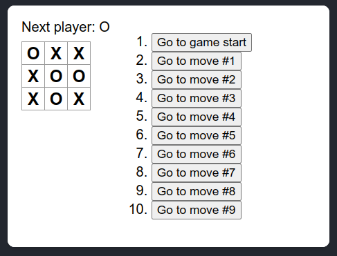

Bagian sebelah kanan yang menunjukkan *history* 
permainan dapat dilewati jika dirasa tutorial cukup
panjang.

##  Instalasi dan persiapan 

Tutorial ini dapat juga diakses melalui [codesandbox.io](https://codesandbox.io/s/ljg0t8`) 
tanpa perlu melakukan instalasi secara lokal. Namun kita
akan melakukan tutorial untuk versi lokal supaya dapat memahami juga
proses instalasi dan persiapan untuk menyusun program menggunakan 
React. 

Disini kita tidak menggunakan React project initialization
secara langsung karena alasan keamanan 
(lihat tulisan berikut: [npm audit: Broken by Design](https://overreacted.io/npm-audit-broken-by-design/)). Disini kita akan 
menggunakan Next.js sebagai React framework.  

Langkah-langkah untuk mempersiapkan *workspace*
1. Install Node.js (lihat kembali pertemuan 1)

2. Buatlah direktori `tic-tac-toe` sebagai *workspace*

3. Didalam direktori `tic-tac-toe`, buatlah file `package.json` 
   dengan isi *empty object* sebagai berikut:     
   ```json
   {
   }
   ```
   Buka terminal di VSCode, dan pindah lokasi 
   *working directory* ke dalam direktori 
   `tic-tac-toe`. Lalu jalankan perintah berikut melalui terminal di VSCode, 
   ```bash
   npm install react react-dom next
   ```

4. Setelah menjalankan perintah di atas struktur direktori
   menjadi seperti berikut: 
   ```
   tic-tac-toe/
   ├─ node_modules/
   ├─ package-lock.json
   ╰─ package.json 
   ```
5. Susun secara rapi data JSON dalam `package.json` dan tambahkan
   *property* berikut setelah *property* `dependencies` (ingat koma pemisah
   antar *property name*):
   ```json
   {
    "scripts": {
      "dev": "next dev"
    }
   }
   ```
   *Property* tersebut akan memberikan kita perintah untuk 
   menjalankan `npm run dev` menggunakan Next.js framework.

7. Download dua folder `pages` dan `styles` beserta isinya di
   [GitHub repository SI-201-404-structured-programming](https://github.com/LugoBlogger/SI-201-404-structured-programming/tree/master/examples/tic-tac-toe). Letakkan kedua folder tersebut
   di dalam *working directory* `tic-tac-toe`, sehingga
   didapatkan susunan direktori sebagai berikut:
   ```
   tic-tac-toe/
   ├─ node_modules/
   ├─ pages/
   │  ├─ _app.js
   │  ├─ App.js
   │  ╰─ index.js
   ├─ styles/
   │  ╰─ styles.css
   ├─ package-lock.json
   ╰─ package.json 
   ```

6. Jalankan `npm run dev` di terminal (posisi *working directory*
   berada di direktori `tic-tac-toe`).
   Tunggu sampai Next.js selesai melakukan *compiling* 
   seperti pada gambar di bawah ini

   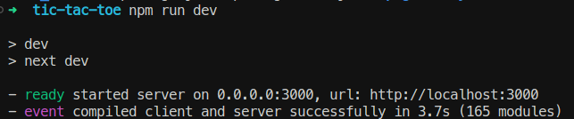

   dan kemudian buka alamat berikut
   di web browser: `localhost:3000`. Jika berhasil akan
   didapatkan tampilan seperti berikut:

   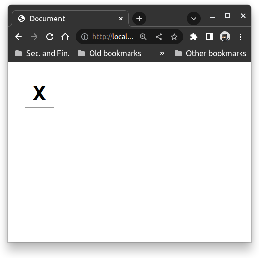


## Gambaran singkat terkait program dan React

Selama pengembangan program ini kita akan membuka secara bersamaan
VSCode dan web browser (dalam contoh ini akan di pakai Google
Chrome Web Browser). Ketika kita mengetikkan perintah di terminal
`npm run dev`, Next.js framework akan senantias terus menerus
melakukan `fast refresh` ketika ada di perubahan dalam program
yang kita ketikan di VScode, sehingga setiap perubahan 
(selama kode benar) akan segera di tampilkan ke web browser.
Apabila terjadi sesuatu yang tidak semestinya seperti *bug*, 
maka cukup dilakukan perintah penghentian *localhost* dengan
menekan tombol Ctrl+C di terminal VSCode.

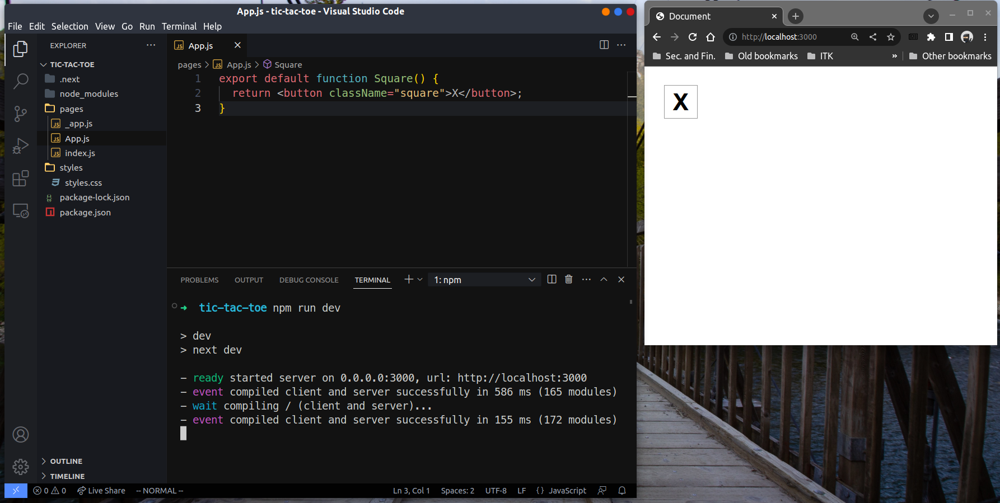 


 
### Isi folder `pages` dan `styles`.

Selama proses pembuatan program Tic-Tac-Toe, kita akan 
sering mengedit file `App.js`.

#### `App.js`
Di dalam file `App.js` terdapat potongan kode JavaScript berikut:
```js
export default function Square() {
  return <button className="square">X</button>;
}
```
Potongan kode di atas merupakan fungsi JavaScript bernama 
`Square()` tanpa parameter (input). Keyword `export` menunjukkan
bahwa fungsi ini akan di-*export* supaya bisa dipanggil oleh berkas
lain (yaitu `index.js`). Keyword `default` merupakan penunjuk
bahwa secara *default* fungsi ini akan di-*export* apabila
terdapat lebih dari satu fungsi di dalam file `App.js`.

Fungsi `Square()` ini akan dipanggil dan memberikan output di 
*web browser* sebagai suatu kotak yang berisi huruf "X".

Pada bagian `return`, kita melihat terdapat HTML element `<button>`
dengan attribute `className="square"`. Attribute ini akan 
secara otomatis melakukan *look-up* terhadap `styles.css` yang
terdapat dalam folder `styles`. Kita melihat disini terdapat
campuran sintaks HTML dan JavaScript, kode semacam ini 
disebut JSX (JavaScript XML).


#### `styles.css`

Merupakan file yang digunakan untuk mengatur *styling* dari
HTML element, seperti elemen `<button>` yang diatur
oleh `className="square"` yang secara otomatis 
memanggil styling `.square` dari file `styles.css`. 
Ada beberapa `classNames` yang telah diatur styling nya 
dan akan digunakan selama pembuatan 
program:
- `.board-row`
- `.status`
- `.game`
- `.game-info`


#### `index.js`

```js
import App from './App';
import Head from 'next/head';

export default function HomePage() {
  return (
    <>
      <Head>
        <title>Document</title>
      </Head>
      <div id="root">
        <App />
      </div>
    </>
  );
}
```

Dua baris `import` di atas digunakan untuk memanggil fungsi 
`Square` di `App.js` yang akan memberikan keluaran (*return value*)
berupa element `<button>`. Element `<button>` ini akan diapit
(*wrapped*) dalam element `<div id="root">  </div>`.
Element `<Head>` merupakan komponen dalam Next.js yang digunakan
untuk menambahkan komponen di dalam element `<head>` HTML.

File ini menjadi jembatan antara `App.js` dan *web browser*.
Di dalam tutorial ini, kita tidak akan menyentuh file ini.


#### `_app.js`

```js
import '../styles/styles.css';

export default function App({ Component, pageProps }) {
  return <Component {...pageProps} />;
}
```

Merupakan file default dari Next.js framework yang harus ada
untuk menjembatani antara styling `styles.css` dan HTML 
yang di-*generate* oleh React. Semua file `.css` yang
ada di dalam folder `styles` ini akan mempengaruhi styling 
website secara global. Untuk melakukan styling secara tersendiri
untuk masing-masing halaman web dapat dilihat pada tutorial
[Create Your First App](https://nextjs.org/learn/basics/assets-metadata-css/layout-component) di dokumentasi Next.js.
Disini kita tidak menggunakan prosedur tersebut.


### Membuat papan permainan Tic-Tac-Toe

Untuk membuat papan permainan Tic-Tac-Toe yang terdiri
dari 9 kotak yang disusun dalam grid 3x3, pertama
kita mencoba untuk menggandakan setiap `<button>` element
di dalam file `App.js`.

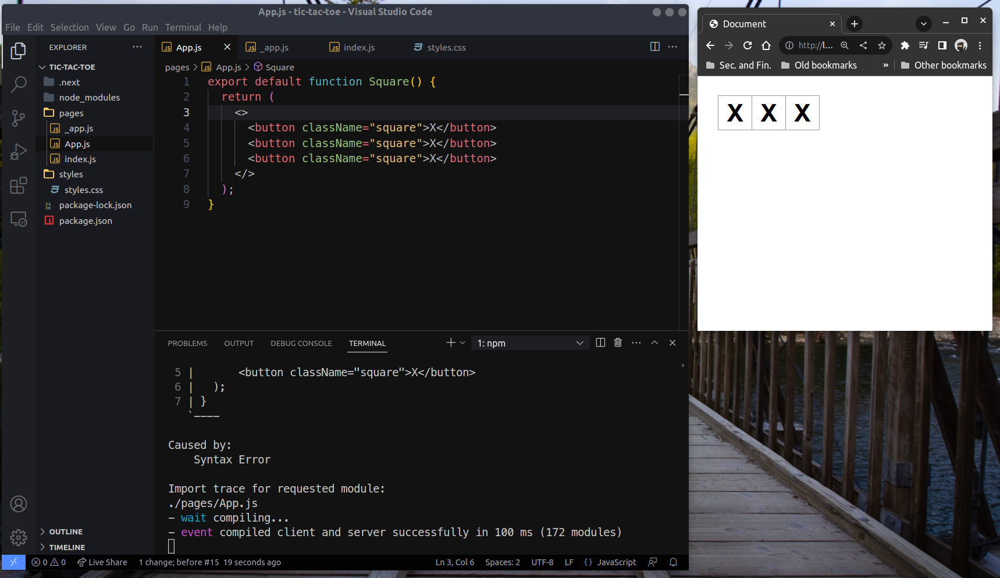

Pada kode di `App.js`, kita menambahkan dua buah `<button>`
element dan apitan `<> </>`. Apitan ini dikenal sebagai
*Fragment element* dalam komponen React. Fragment element ini 
bertujuan untuk dapat memberikan keluaran HTML element
yang saling bersebelahan dan dijadikan satu grup nilai luaran.
Sama seperti halnya Array untuk mengumpulkan beberapa nilai menjadi satu, Fragment element digunakan untuk menyatukan
beberapa HTML element menjadi satu element besar.
Lalu terakhir keluaran ini perlu diapit oleh tanda kurung `()`
yang menyatakan keluaran ini dilihat sebagai satu `expression`, 
```js
export default function Square() {
  return (
    <>
      <button className="square">X</button>
      <button className="square">X</button>
      <button className="square">X</button>
    </>
  );
}
```

Untuk membuat papan permainan Tic-Tac-Toe 3x3, kita
perlu membagi setiap tiga buah buton dengan elemmnt `<div>`.
Agar setiap pembagian `<div>` berada di baris berikutnya
(tersusun vertikal)
maka kita dapat menambahkan pengaturan styling `.board-row`
yang sudah disediakan di dalam `styles.css` dan cukup memanggilnya
dengan menambahkan `className="board-row"`

Karena kita telah menyusun papan, 
kita tidak lagi menamakan fungsi di dalam `App.js` ini 
sebagai `Square()` melainkan sebagai `Board()`
dan juga untuk mempermudah penyusunan program kedepan
kita ganti teks "X" di setiap `<button>` dengan 
teks 1, 2, 3, ..., 9. Hasil akhir file `App.js` adalah sebagai 
berikut

```js
export default function Board() {
  return (
    <>
      <div className="board-row">
        <button className="square">1</button>
        <button className="square">2</button>
        <button className="square">3</button>
      </div>
      <div className="board-row">
        <button className="square">4</button>
        <button className="square">5</button>
        <button className="square">6</button>
      </div>
      <div className="board-row">
        <button className="square">7</button>
        <button className="square">8</button>
        <button className="square">9</button>
      </div>
    </>
  );
}
```

dan mendapatkan tampilan akhir di browser.

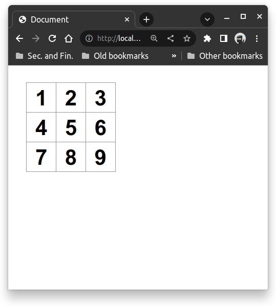


### React `props` untuk data manipulasi komponen `Square`

React `props` merupakan nama lain untuk data yang dapat
kita sematkan ke HTML element. Dengan gabungan fungsi
HTML element dari bawaan framework React dan props
kita dapat membangun HTML element dengan attribute
dan text terapit lebih dinamik (nilainya dapat kita
ubah-ubah sesuai kebutuhan tanpa harus menulis ulang
HTML element)

Seperti kita ketahui di dalam fungsi `Board()` di file
`App.js`, kita menuliskan sembilan kali `<button>`.
Kita dapat menuliskan fungsi `Square()` untuk masing-masing
kotak, dan memanggil fungsi `Square()` di dalam `Board()`.
Sehingga `App.js` menjadi

```js
function Square({ value }) {
  return <button className="square">{value}</button>
}

export default function Board() {
  return (
    <>
      <div className="board-row">
        <Square value="1"/>
        <Square value="2"/>
        <Square value="3"/>
      </div>
      <div className="board-row">
        <Square value="4"/>
        <Square value="5"/>
        <Square value="6"/>
      </div>
      <div className="board-row">
        <Square value="7"/>
        <Square value="8"/>
        <Square value="9"/>
      </div>
    </>
  );
}
```
React `props` di atas diwakili oleh parameter `value` 
dalam kelas `Square()` di atas. Perlu diingat React `props`
disini merupakan object sehingga ketika diinputkan ke dalam
pendefinisian `Square()` kita perlu melakukan destructuring
atau dalam kata lain menambahkan tanda kurung kurawal.
Demikian juga selama dalam lingkup HTML element, parameter
`value` harus diapit dalam kurung kurawal (ingat kesamaan
ini dengan penandaan variable di template literal). 
Hasil didapatkan seperti sebelumnya namun kode JavaScript
kita lebih terstruktur dan lebih modular (terpisah-pisah
dengan jelas tiap komponennya)


### Menambahkan *interactivity*
Tahap berikutnya adalah menambahkan fungsi callback `handleClick`
pada attribute di element `<button>` di dalam komponen `Square()`.
Fungsi `handleClick` ini nantinya akan terpicu ketika
user melakukan klik terhadap kotak-kotak komponen `Square()`
di dalam komponen `Board()` dan lalu melakukan setting nilai
teks isian element `<button>` menjadi "X".

Pertama kita buat fungsi callback `handleClick()` dan 
mengubah komponen `Square()` sebagai berikut:

```js
function handleClick() {
  console.log("clicked");
}

function Square({ value }) {
  return (
    <button 
      className="square"
      onClick={handleClick}
    >
      {value}
    </button>
  );
}
```
Pada potonga update kode bagian komponen `Square()` di atas
terlihat bahwa fungsi callback `handleClick()` akan 
melakukan *print out* ke console setiap `Square()` element
di klik pada papan permainan `Board()`. Kita jadikan fungsi
callback ini sebagai nilai attribute element `<button>`
untuk property `onclick`.

Pada gambar di bawah ini terlihat jika kita melakukan 
proses klik ke semua kotak (sembilan kali klik), 
maka console di bagian Developer Tools web browser akan 
mencetak sembilan kali pesan `clicked` (tertera angka 9)

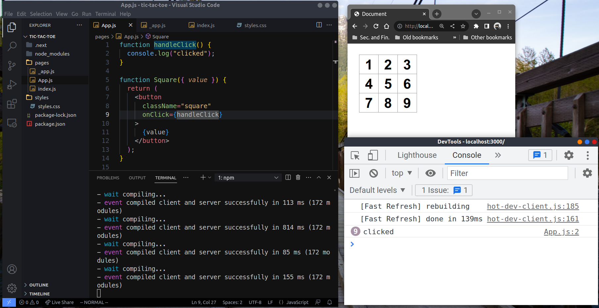

Untuk bisa menyimpan nilai "X" di masing-masing komponen
`Square()` ketika dilakukan klik, kita perlu suatu object
baru untuk mengingat hal ini. React menyediakan object ini
sebagai suatu *state*. Karena ada sembilan kotak, maka
setiap kotak harus dapat menyimpan masing-masing state
dan juga kita harus bisa memanipulasi setiap *state* ini
dari tidak ada teks "X" menjadi ada.

Berikut adalah update terakhir untuk fungsi callback `handleClick()` dan `Square()`

```js
import { useState } from 'react';

function handleClick(setValue) {
  setValue("X");
}

function Square() {
  const [value, setValue] = useState(null);

  return (
    <button 
      className="square"
      onClick={() => handleClick(setValue)}
    >
      {value}
    </button>
  );
}
```
Pertama kita melakukan import object `useState` dari React library.
Kemudian kita inisialisasi *state* dengan nilai null melalui
pemanggilan object `useState(null)`. Keluaran dari 
object `useState` merupakan dua buah object. Yang pertama
adalah variable `value` yang akan menyimpan `state`
dan yang kedua adalah `setValue` digunakan sebagai fungsi
untuk mengubah `state`. 

Terlihat juga bahwal fungsi callback `handleClick` memiliki
tambahan parameter `setValue` yang akan mengupdate nilai
`value` ketika element `<button>` di klik oleh user.
Kita melihat juga, nilai dari attribute `onclick` merupakan
suatu callback function yang memamnggil fungsi `handleClick`.
Kita tidak bisa mengatur secara langsung `onclick={handleClick(setValue)}` karena dengan melakukan seperti itu kita tidak
lagi memberikan callback function namun memberikan nilai
return dari `handleClick`.

Kita juga tidak lagi memerlukan argument di komponen
`Square()`, maka attribute `value` saat pemanggilan `Square()`
di komponen `Board()` tidak perlu lagi dilakukan, sehingga
didapatkan bentuk akhir komponen `Board()` sebagai berikut:

```js
export default function Board() {
  return (
    <>
      <div className="board-row">
        <Square />
        <Square />
        <Square />
      </div>
      <div className="board-row">
        <Square />
        <Square />
        <Square />
      </div>
      <div className="board-row">
        <Square />
        <Square />
        <Square />
      </div>
    </>
  );
}
```

Jika telah selesai update komponen `Square()`
dan `Board()` di atas maka kita bisa lihat perubahan
`Square()` element ketika dilakukan klik seperti
pada gambar di bawah ini

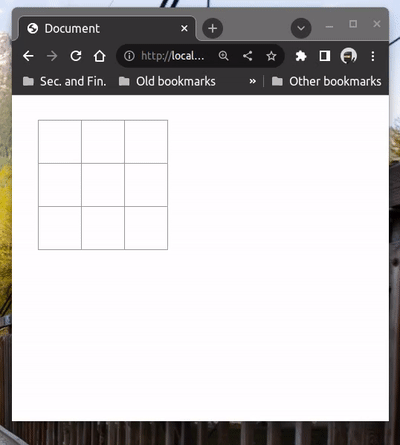


## Menyelesaikan program Tic-Tac-Toe

Jika telah sampai tahap ini, kita telah membangun kerangka
dasar permainan Tic-Tac-Toe dan tinggal menambahkan fitur-fitur
tambahan lainnya agar dapat bergantian mengisi kotak dengan 
"X" dan "O". Serta juga penentuan akhir permainan siapa yang
menang atau terjadi *draw*.

Sejauh ini kita masih menyimpan semua state permainan di 
masing-masing komponen `Square()`. Pendekatan ini masih
 mengharuskan kita untuk menyusun mekanisme 
komunikasi antar `Square()` terkait state mereka.
Penulisan program dengan mekanisme state di setiap `Square()`
akan menghasilkan program yang cukup rumit dipahami dan 
amat susah untuk di lakukan *refactor* (mekaniseme
untuk memecah program menjadi bagian-bagian kecil komponen yang 
saling independen dan dikoordinasi oleh satu komponen besar).

Pendekatan yang lebih baik adalah kita menyimpan semua *state*
dari komponen `Square()` di dalam komponen `Board()` lalu 
mengkomunikasikan *state* dan *callback function*
ke setiap `Square()`. Apabila terjadi suatu *clicked event* oleh
user di suatu `Square()`, *callback function* yang didistribusikan
ini akan dipanggil dan memicu perubahan `state` di komponen 
`Board()`. Lalu komponen `Board()` akan mengkomunikasikan 
kembali perubahasa `state` ini ke komponen `Square()` tersebut.

Jika digambarkan proses di atas adalah sebagai berikut:

**Mekanisme perubahan state oleh`Board()**
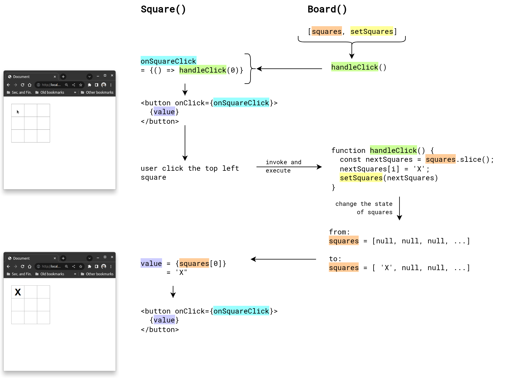

### Memindahkan `useState` dari `Square()` ke `Board()` (lifted up)

Seperti yang telah dijelaskan di paragraf sebelumnya.
Kita susun terlebih dahulu sembilan buah state di `Board()`.
Kita juga mendeklarasikan fungsi `handleClick()` dengan 
parameter nomor urut `Square()`, state semua `Squares()`
(dalam variable `squares`) dan fungsi untuk mengubah-ubah
state `squares` (yaitu `setSquares`).
Di dalam fungsi callback `handleClick` ini, kita melakukan 
penggandaan Array `squares` menggunakan array method
`.slice()`. Kita perlu menggandakan Array state ini dengan tujuan
untuk fitur tambahan *history* di bagian terakhir pembuatan 
program ini.

```js
function handleClick(i, squares, setSquares) {
   const nextSquares = squares.slice();
   nextSquares[i] = 'X';
   setSquares(nextSquares);
}

export default function Board() {
  const [squares, setSquares] = useState(Array(9).fill(null));

  return (
    <>
      <div className="board-row">
        <Square 
          value={squares[0]} 
          onSquareClick={() => handleClick(0, squares, setSquares)}/>
        <Square 
          value={squares[1]} 
          onSquareClick={() => handleClick(1, squares, setSquares)}/>
        <Square 
          value={squares[2]} 
          onSquareClick={() => handleClick(2, squares, setSquares)}/>
      </div>
      <div className="board-row">
        <Square 
          value={squares[3]} 
          onSquareClick={() => handleClick(3, squares, setSquares)}/>
        <Square 
          value={squares[4]} 
          onSquareClick={() => handleClick(4, squares, setSquares)}/>
        <Square 
          value={squares[5]} 
          onSquareClick={() => handleClick(5, squares, setSquares)}/>
      </div>
      <div className="board-row">
        <Square 
          value={squares[6]} 
          onSquareClick={() => handleClick(6, squares, setSquares)}/>
        <Square 
          value={squares[7]} 
          onSquareClick={() => handleClick(7, squares, setSquares)}/>
        <Square 
          value={squares[8]} 
          onSquareClick={() => handleClick(8, squares, setSquares)}/>
      </div>
    </>
  );
}
```

Berikutnya kita melakukan perubahan pada kompone `Square()` sehingga mampu
menerima dua input *property*: `value` dan `onSquareClick`.
Disini komponen `Square()` hanya berperan sebagai penerima user input 
ketika user melakukan klik dengan mouse dan kemudian menerima response
dari komponen Board() update `squares` untuk posisi di kotak yang di klik
(lihat mekanisme pencetakan teks 'X' di gambar 
**Mekanisme perubahan state oleh `Board()`**). Dan
juga komponen `Square()` hanya berfungsi untuk menampilkan
state yang sedang berlangsung (atau dalam hal ini nilai
`squares`).

Berikut adalah perubahan kode untuk komponen `Square()`
```js
function Square({ value, onSquareClick}) {
  return (
    <button className="square" onClick={onSquareClick} >
      {value}
    </button>
  );
}
```
Hasil akhir yang didapatkan tetap sama, namun kode yang kita
tulis lebih struktur dan mudah untuk dipahami.


### Kondisi untuk menambahkan pergantian pemain
Fitur berikutnya yang dibangun adalah pergantian pemain
ketika melakukan klik di tempat berbeda.
Pemain awal yang akan memulai terlebih dahulu adalah pemain
dengan tanda "X" dilanjutkan pemain dengan tanda "O", 
demikian seterusnya bergantian.

Untuk bisa melakukan pergantian pemain, kita butuh suatu
*state* untuk mencatat kondisi pemain manakah yang akan
mengklik kotak `Square()`.
Disini kita membuat `state` dan `setState`-nya untuk state
ini dari React framework sebagai `xIsNext` dan `setXIsNext`.
*State* ini akan menyimpan nilai boolean (`true` atau `false`)
yang menyatakan bahwa proses klik ke kotak `Square()`
adalah untuk pemain `X` atau tidak.

Untuk dapat menggunakan *state* `xIsNext` kita perlu mengubah callback function *handleClick()* dengan menambahkan beberapa kondisi:
1. Jika *state* untuk kotak ke-`i` tidak kosong (bukan `null`)
   dalam program kita dinyatakan dalam `squares[i]`
   maka kita tidak perlu mengganti isian kotak `Square()`.
2. Jika *state* untuk `xIsNext` adalah `true` maka kita akan
   melakukan isian kotak `Square()` (diposisi manapun
   ketika kotak diklik) dengan 'X'.
3. Jika *states* untuk `xIsNext` adalah `false` maka kita akan
   melakukan isian kotak `Square()` (diposisi manapun
   ketika kotak diklik)  dengan 'O'.
4. Setelah melakukan opsi (2) atau (3), *state* untuk `xIsNext`
   harus dinegasi (dari `true` menjadi `false` atau sebaliknya)
   supaya langkah berikutnya (ketika user melakukan klik
   pada kotak berikutnya) adalah pemain yang lain.

Implementasi kondisi (1) sampai (4) di atas akan membuat program
kita melakukan pergantian isian teks "X" dan "O" setiap melakukan
klik kotak yang berbeda. Berikut perubahan yang terjadi dalam 
kode program untuk bagian fungsi callback `handleClick()`
dan komponen `Board()`.

```js
function handleClick(i, squares, setSquares, xIsNext, setXIsNext) {
  if (squares[i]) {
    return;
  }

  const nextSquares = squares.slice();
  if (xIsNext) {
    nextSquares[i] = 'X';
  } else {
    nextSquares[i] = 'O';
  }

  setSquares(nextSquares);
  setXIsNext(!xIsNext);
}

// Square() compoonent does not change

export default function Board() {
  const [xIsNext, setXIsNext] = useState(true);
  const [squares, setSquares] = useState(Array(9).fill(null));

  return (
    <>
      <div className="board-row">
        <Square 
          value={squares[0]} 
          onSquareClick={() => handleClick(
            0, squares, setSquares, xIsNext, setXIsNext)}/>
        <Square 
          value={squares[1]} 
          onSquareClick={() => handleClick(
            1, squares, setSquares, xIsNext, setXIsNext)}/>
        <Square 
          value={squares[2]} 
          onSquareClick={() => handleClick(
            2, squares, setSquares, xIsNext, setXIsNext)}/>
      </div>
      <div className="board-row">
        <Square 
          value={squares[3]} 
          onSquareClick={() => handleClick(
            3, squares, setSquares, xIsNext, setXIsNext)}/>
        <Square 
          value={squares[4]} 
          onSquareClick={() => handleClick(
            4, squares, setSquares, xIsNext, setXIsNext)}/>
        <Square 
          value={squares[5]} 
          onSquareClick={() => handleClick(
            5, squares, setSquares, xIsNext, setXIsNext)}/>
      </div>
      <div className="board-row">
        <Square 
          value={squares[6]} 
          onSquareClick={() => handleClick(
            6, squares, setSquares, xIsNext, setXIsNext)}/>
        <Square 
          value={squares[7]} 
          onSquareClick={() => handleClick(
            7, squares, setSquares, xIsNext, setXIsNext)}/>
        <Square 
          value={squares[8]} 
          onSquareClick={() => handleClick(
            8, squares, setSquares, xIsNext, setXIsNext)}/>
      </div>
    </>
  );
}
```

Di bagian `Board()` terlihat deklarasi *state*
untuk `xIsNext` dan fungsi untuk pengubahannya
`setXIsNext`. *State* ini akan terus berubah
dari *state* awal `null` lalu `true`
lalu `false` lalu `true`, demikian seterusnya
bolak balik `true` dan `false` hingga semua kotak
terisi.

Jika kita melihat program di atas kita masih perlu mengubah
satu-satu pemanggilan elemen `<Square>` dengan attribute
`handleClick` yang berbeda. Di bagian 
[Self-exercise](##Self-exercise) kita akan mengeksplorasi 
penulisan kode agar kita hanya cukup menuliskan 
komponen <Square> sekali ditambah penggunaan for loop untuk 
array dimensi 2.

Hasil akhir yang didapatkan dari penambahan fitur pergantian
permain adalah sebagai berikut:

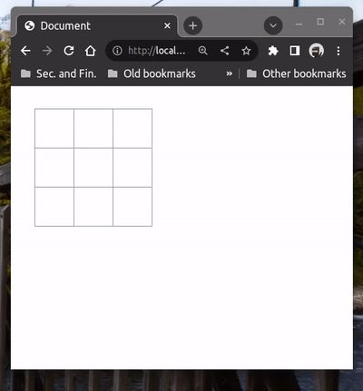


Dari animasi di atas masih tersisa satu bagian
lagi yaitu penentuan pemenang, seperti terlihat
program permainan yang kita buat masih sangat
bersih tanpa ada notifikasi pemain yang menang.

### Menambahkan fitur pemberitahuan untuk pemenang

Untuk menentukan pemain yang menang, kita perlu tahu
semua kondisi menang ketika kombinasi nomor kotak-kotak ini 
terisi dengan teks yang sama (semua 'X' atau semua 'O')
```js
 [0, 1, 2], // horizontal atas
 [3, 4, 5], // horizontal tengah
 [6, 7, 8], // horizontal bawah
 [0, 3, 6], // vertikal kiri
 [1, 4, 7], // vertikal tengah
 [2, 5, 8], // vertikal kanan
 [0, 4, 8], // diagonal dari kiri atas ke kanan bawah
 [2, 4, 6], // diagonal dari kanan atas ke kiri bawah
```

Perlu diingat, setiap proses klik kotak `Square()` kita harus 
memeriksa kondisi menang yang sudah disebutkan di atas.
Jadi sangat jelas, syarat menang tersebut harus disisipkan 
dalam fungsi callback `handleClick()`.
Ketika menang fungsi callback `handleClick()` harus berhenti.
Untuk itu kita perlu membuat suatu fungsi baru untuk menentukan
apakah ketika user melakukan klik pada suatu kotak, kondisi menang
sudah terpenuhi atau tidak. 
Kita sebut fungsi baru itu `calculateWinner()`.
Kita dapat letakkan fungsi ini sesudah deklarasi komponen 
`Block()` 

```js
function calculateWinner(squares) {
  const lines = [
    [0, 1, 2], 
    [3, 4, 5], 
    [6, 7, 8], 
    [0, 3, 6], 
    [1, 4, 7], 
    [2, 5, 8], 
    [0, 4, 8], 
    [2, 4, 6], 
  ];

  for (let i = 0; i < lines.length; i++) {
    const [a, b, c] = lines[i];
    if (squares[a] && (squares[a] === squares[b]) && (squares[a] === squares[c])) {
      return squares[a];
    }
  }

  return null;
}
```

Terlihat dari kode di atas, kita melakukan semua uji posisi menang
dengan cara melakukan iterasi ke array dimensi 2, `lines`.
Kemudian di setiap iterasi dilakukan pengujian apakah isian teks `Squares`
(dalam hal ini diwakili oleh *state* `squares`) berisi teks 'X" semua atau
'O" semua. Dan juga perlu dipastikan bahwa *state* ini tidak boleh *null* 
(diwakili oleh kondisi pertama `squares[a]`)

Jika semua syarat menang tidak dipenuhi maka fungsi `calculateWinner` akan
memberikan keluaran berupa `null`.

Tahap berikutnya adalah memanggil fungsi `calculateWinner()` ini di dalam 
fungsi callback `handleClick()` serta penulisan pesan pemain yang menang.
Berikut perubahan kode untuk fungsi callback `handleClick()` dan 
komponen `Board()`

```js
function handleClick(i, squares, setSquares, xIsNext, setXIsNext) {
  if (squares[i] || calculateWinner(squares)) {
    return;
  }

  // the rest of lines are the same as before
}
```

```js
export default function Board() {
  const [xIsNext, setXIsNext] = useState(true);
  const [squares, setSquares] = useState(Array(9).fill(null));

  const winner = calculateWinner(squares);
  let statusText;
  if (winner) {
    statusText = "Winner: " + winner;
  } else {
    statusText = "Next player: " + (xIsNext ? "X" : "O");
  }

  // the rest of lines are the same as before
}
```

Berikut hasil program ketika dilakukan proses klik

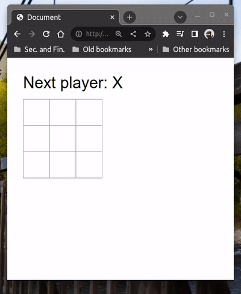


Jika sudah sampai pada titik ini berarti kita sudah menyelesaikan
program Tic-Tac-Toe untuk fitur paling dasar. Masih ada tambahan fitur
yang masih bisa dikembangkan seperti pemberitahuan ketika terjadi draw,
fitur *time travel* untuk menampilkan *history* langkah, dan fitur
penanda kotak-kotak bagi pemenang (perlu mengubah CSS element). Semua
fitur tambahan itu dapat di baca pada subtopik opsional berikutnya tentang
[*time travel*](##(Opsional)Fitur-tambahan-time-travel-untuk-sejarah-langkah) 
dan di bagian [Self-exercise](##Self-exercise).

## (Opsional) Fitur tambahan *time travel* untuk sejarah langkah

[Akan ditambahkan nanti, tunggu dengan sabar . . .]


## Self-exercise
> Self-exercise ini tidak perlu dikumpulkan, hanya sebagai
> tambahan bagi yang ingin melakukan eskplorasi lebih dalam
> terkait JavaScript dan game Tic-Tac-Toe. Self-exercise
> ini diambil dari Tutorial: Tic-Tac-Toe di dalam dokumentasi
> React.

1. Gantilah text dalam tombol *history*, sehingga menjadi 
   tertulis "You are at move #...".
2. Tulis ulang komponen `Square` di dalam `Board` 
   menggunakan dua *loops*.
3. Tambahkan tombol on-off (*toggle button*) 
   untuk mengurutkan urutan langkah dari awal sampai akhir 
   (atau susunan sebaliknya)
4. Ketika ada pemain yang menang, tambahkan penanda
   (*highlight*) ke kotak-kotak `Board` Tic-Tac-Toe 
   untuk pemain yang menang. Jika terjadi *draw*, 
   tampilkan pesan bahwa terjadi hasil pertandingan *draw*
   (seimbang)
5. Tampilkan lokasi setiap langkah dalam format (baris, kolom)
   di setiap daftar *history* langkah.
