# Modul praktikum - Minggu 15 - JavaScript dalam Web Browser (bagian 2)

Dosen pengampu: **Henokh Lugo Hariyanto**  
Asisten mata kuliah: **Dahayu Azhka Daeshawnda - (10231027)**; **Dyno Fadhillah Ramadhani- (10231033)**

**Tujuan**:
- Mampu menerapakan pemahaman JavaScript ke dalam aplikasi berbasis
  *web browser*
- Mampu memahami penggunaan *JavaScript library* `d3.js` 

> Tips belajar bahasa pemrograman adalah mengetik ulang perintah yang kita 
> temukan di buku atau di internet, lalu kita ubah-ubah untuk menguji pemahaman
> kita sudah tepat atau belum. Faktor bermain-main dan eksplorasi sangat 
> diperlukan untuk memahami setiap perintah bahasa pemrograman yang kita pelajari.
> Setiap potongan kode di bawah dapat dijalankan secara lokal (bersamaan
> dengan file .html dan .css) menggunakan ekstensi VSCode `Preview on Web Server`

Pada minggu ini, kita akan belajar salah satu topik yang *mungkin*
sangat menarik yaitu *data visualization* menggunakan *JavaScript library*
`d3.js`. Kita akan belajar dan memahami penggunaan `d3.js` berdasarkan
referensi [(Murray, 2017) - Interactive Data Visualization for the Web](https://www.oreilly.com/library/view/interactive-data-visualization/9781491921296/).  
Referensi ini merupakan referensi standar dalam 
pembelajaran terkait visualisasi (lihat online course 
[CS 171 - Visualization](https://www.cs171.org/2022/resources/#) 
dari Harvard University) 

Sedikit penjelasan tentang `d3.js` adalah merupakan *JavaScript*
library yang merupakan singkatan dari *Data-Driven Documents*. 
Library ini dibangun oleh Mike Bostock (dan beberapa kontributor
lainnya) yang dapat dilihat di dalam repositori berikut 
[GitHub: D3.js](https://github.com/d3/d3/wiki)

Di akhir tutorial ini kita akan mencoba membuat plot batas administrasi 
kecamatan kota Balikpapan. Ada banyak manfaat dari penerapan plot ini
terutama untuk *programmer* yang bekerja di dunia GIS (Geospatial Information
System). GIS ini bisa dikatakan merupakan cabang ilmu dari Information System.

## Instalasi `d3.js`

Pertama-tama siapkan tiga buah files (.html, .css, .js). Untuk file .html
akan berperan sebagai *viewer* (atau interface antara file .js dengan
web browser). Untuk file .css akan berperan sebagai *styling* document .html.

Berikut isi standard untuk ketiga berkas tersebut:

- **`main.html`**
  ```html
  <html>
    <head>
      <link rel="stylesheet" href="./styles.css">
      <script src="../lib/d3.v7.min.js"></script> 
    </head>
    <body>
      <script src="./plotd3.js"></script>
    </body>
  </html>
  ```
- **`styles.css`**
  ```css
  * {
    font-family: "IBM Plex Sans", "Helvetica Neue", 
              Arial, sans-serif;
  }
  ```

- **`plotd3.js`**
  ```js
  // Akan kita isi dengan fungsi plot dari d3.js
  ```

Ketiga file tersebut harus di taruh di tempat yang sama. Sebagai contoh
kita menggunakan *working directory*: `d3-hello-world`. Maka direktori kita
akan terlihat seperti berikut:
```
...
├─ d3-hello-world/
│  ├─ main.html
│  ├─ plotd3.js
│  ╰─ styles.css
├─ lib/
│  ╰─ d3.v7.min.js
...
```

Pada contoh di atas terdapat tambahan folder `lib` yang merupakan tempat 
*library* d3.js. File `d3.v7.min.js` dapat didownload di 
[link berikut](https://d3js.org/d3.v7.min.js) (Klik kanan lalu pilih "Save as..."),

Sedikit penjelasan terkait library d3.js ini terdapat dua jenis
berkas: (1) _non-minified_ (`d3.v7.js`) dan 
(2) _minified_ (`d3.v7.min.js`). Gunakan _non-minified_ untuk
tahap _debugging_, dan _minified_ untuk tahap _production_
supaya mendapatkan kinerja visualiasi yang lebih cepat.
Untuk lebih jelas dapat dilihat di ["D3 in vanilla HTML"](https://d3js.org/getting-started#d3-in-vanilla-html)

Berikutnya kita akan membuat versi "Hello World!" untuk d3.js
(file keseluruhan dapat dilihat di dalam direktori 
[`d3-hello-world`](./week-15-scripts/d3-hello-world/)). 
Perintah berikut kita tambahkan ke dalam `plotd3.js`
```js
d3.select("body").append("p").text("Hello World!");
```

Perintah diatas mengatakan bahwa menggunakan library d3.js, 
kita memanggil fungsi `.select()` untuk memilih HTML element `<body>`.
Lalu di dalam HTML element `<body>` ini kita tambahkan (*append*)
dengan HTML element `<p>`. Dan terakhir di dalam HTML element 
paragraph `<p>`, kita isi dengan text "Hello World!".

Jika prosedur yang diikut benar, maka kita akan mendapatkan hasil
berikut di *web browser* (setelah menjalankan VSCode extension: 
Preview on Web Server)

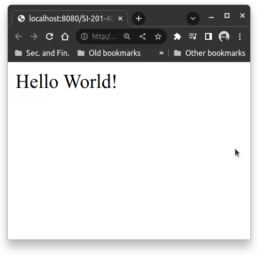


## Working with Data

Berikutnya kita akan melakukan pembacaan data dari file berformat
`.csv`. Dalam tutorial ini kita akan menggunakan file `food.csv`
(yang didapat didownload [disini](./week-15-scripts/datasets/food.csv))
yang berisi data berikut:

**food.csv**
```csv
Food,Deliciousness
Apples,9
Green Beans,5
Egg Salad Sandwich,4
Cookies,10
Liver,0.2
Burrito,7
```

Kemudian kita buat *working directory* baru, dan kita namakan
`d3-binding-data` dengan isi `plotd3.js` sebagai berikut:

**plotd3.js**
```js
function readData(data) {
  console.log(data);
}

d3.csv("../datasets/food.csv")
  .then(readData);
```
File .html dan .css masih sama seperti pada bagian sebelumnya (`main.html`
dan `styles.css`). Berikut kenampakan folder `d3-binding-data`

```
...
├─ d3-binding-data/
│  ├─ main.html
│  ├─ plotd3.js
│  ╰─ styles.css
├─ datasets/
│  ╰─ food.csv
├─ lib/
│  ╰─ d3.v7.min.js
...
```

Program di atas melakukan pembacaan file `.csv` dengan fungsi `.csv`
dari d3.js. Keluaran dari `d3.csv()` adalah suatu *Promise object*
maka kita dapat sisipkan *callback function* dengan method `.then()`
Fungsi *callback* ini akan membaca data dan hasilnya ditampilkan 
di console. Selengkapnya lihat direktori 
[d3-binding-data](./week-15-scripts/d3-binding-data)

Jika prosedur dijalankan dengan benar maka akan didapatkan data
yang tercetak di bagian Console Web Browser seperti gambar
di bawah ini

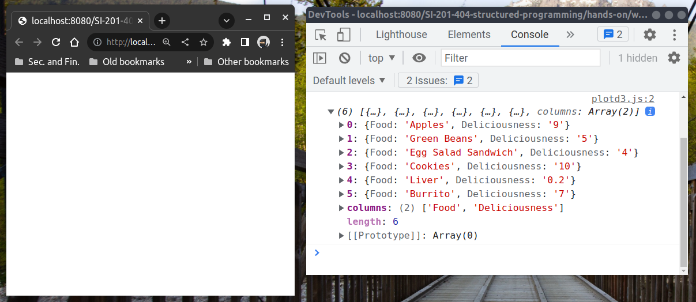

Terlihat di sebelah kanan, enam buah Arrays berisikan object.
Di halaman browser sebelah kiri belum terdapat output apapun, 
karena kita belum menghubungkan hasil pembacaan `.csv` dengan 
web browser.

## Drawing with Data

Pada bagian ini kita akan menggambar data yang dibaca dari `.csv`.
Kita siapkan dulu *working directory* seperti berikut:

```
...
├─ d3-drawing-data/
│  ├─ main.html
│  ├─ plotd3.js
│  ╰─ styles.css
├─ datasets/
│  ╰─ food.csv
├─ lib/
│  ╰─ d3.v7.min.js
...
```

Disini kita hanya melakukan *editing* di file `plotd3.js`.
Sehingga untuk file `main.html` dan `styles.css` masih sama seperti 
sebelumnya. Folder `datasets` dan `lib` dapat menggunakan folder
sebelumnya dengan cara menaruh folder `d3-drawing-data` bersandingan
dengan `d3-binding-data`.

Pertama kita buat kerangka awal pembacaan data dan pendefinisian 
beberapa *layout* seperti lebar dan tinggi grafik, HTML element SVG
sebagai *plot container*

**plotd3.js**
```js
// Set the dimensions and margins of the graph
let margin = { top: 30, right: 30, bottom: 100, left: 60 };
let width = 460 - margin.left - margin.right;
let height = 400 - margin.top - margin.bottom;

// Append the svg object to the body of the page
let svg = d3.select("body")
  .append("svg")
    .attr("width", width + margin.left + margin.right)
    .attr("height", height + margin.top + margin.bottom)
  .append("g")
    .attr("transform",
          "translate(" + margin.left + ", " + margin.top +")");

// Function declaration for making bar chart
function plotBarChart(data) {
  console.log(data);
  console.log(document.querySelector("svg"));
}

d3.csv("../datasets/food.csv")
  .then(plotBarChart);
```

Baris kode JavaScript di atas akan memberikan inisialisasi SVG element
yang dibuktikan dengan mencetak hasil inisialisasi SVG element
di jendela console sebelah kanan terdapat HTML element `<svg>...</svg>`.

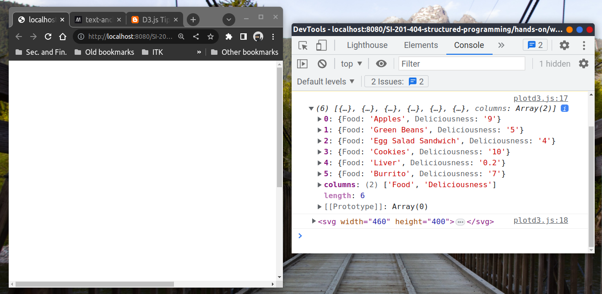

Langkah berikutnya adalah membuat sumbu-x dan y untuk gambar
*Bar Chart* yang akan kita buat. Tambahkan kode berikut di dalam
fungsi `plotBarChart()`

**plotd3.js**
```js
// Some lines omitted

function plotBarChart(data) {
  // Create an x-axis
  let x = d3.scaleBand()
    .range([0, width])
    .domain(data.map((d) => { return d.Food; }))
    .padding(0.2);
  svg.append("g")
    .attr("transform", "translate(0, " + height + ")")
    .call(d3.axisBottom(x))
    .selectAll("text")
      .attr("transform", "translate(-10.0)rotate(-45)")
      .style("text-anchor", "end");

  // Add a y-axis
  let y = d3.scaleLinear()
    .domain([0, 11])
    .range([height, 0 ])
  svg.append("g")
    .call(d3.axisLeft(y));

}

// Some lines omitted
```
Hasil yang didapatkan adalah sebagai berikut:

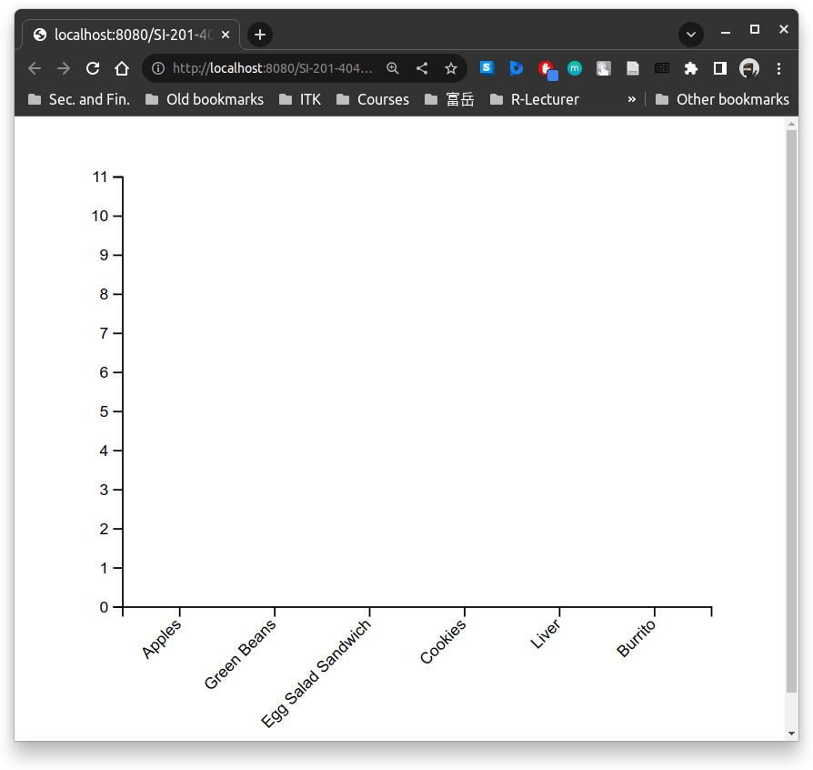

Berikutnya kita akan menambahkan data ke dalam axes tersebut.
Hal itu dapat dilakukan dengan menambahkan baris kode berikut
di dalam fungsi `plotBarChart()`

**plotd3.js**
```js
function plotBarChart(data) {
  // Some lines omitted 

  svg.selectAll("dataBar")
    .data(data).enter()
    .append("rect")
      .attr("x", (d) => { return x(d.Food); })
      .attr("y", (d) => { return y(d.Deliciousness); })
      .attr("width", x.bandwidth())
      .attr("height", (d) => { return height - y(d.Deliciousness); })
      .attr("fill", "teal");
}

// Some lines omitted
```

dan akan didapatkan hasil sebagai berikut:

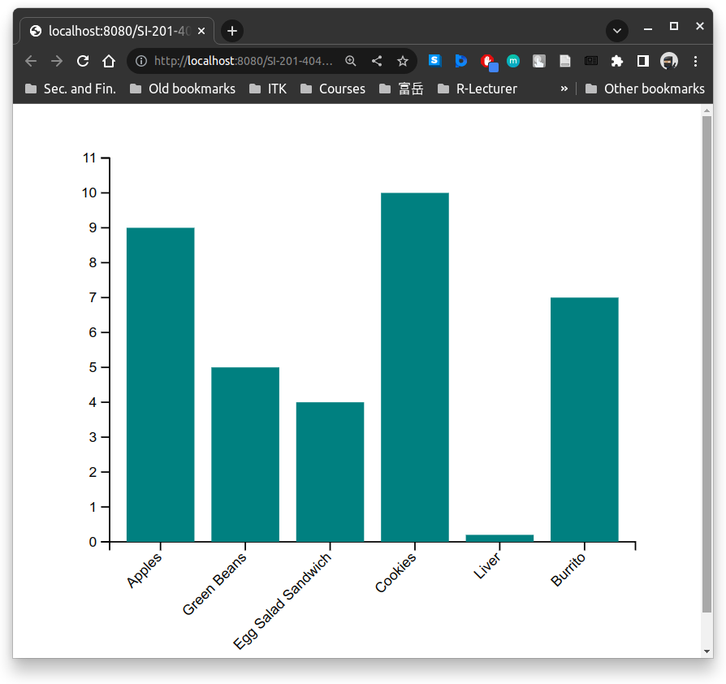

Tahap terakhir adalah penambahan label pada sumbu-y dan judul plot
Hal ini dapat dilakukan dengan menambahkan lagi baris kode berikut
di dalam fungsi `plotBarChart()`

**plotd3.js**
```js
function plotBarChart(data) {
  // Some lines omitted

  // Add y-axis label
  svg.append("text")
    .attr("class", "y label")
    .attr("text-anchor", "middle")
    .attr("transform", "rotate(-90)")
    .attr("y", -margin.left + 20)
    .attr("x", -height / 2)
    .style("font-size", "14px")
    .text("Deliciousness");

  // Add plot title
  svg.append("text")
    .attr("x", (width / 2))
    .attr("y", 0 - (margin.top / 2))
    .attr("text-anchor", "middle")
    .style("font-size", "18px")
    .text("Some delicious food");
}
// Some lines omitted
```

Lalu didapatkan hasil akhir plot Bar Chart menggunakan d3.js dan 
pembacaan data `food.csv` sebagai berikut:

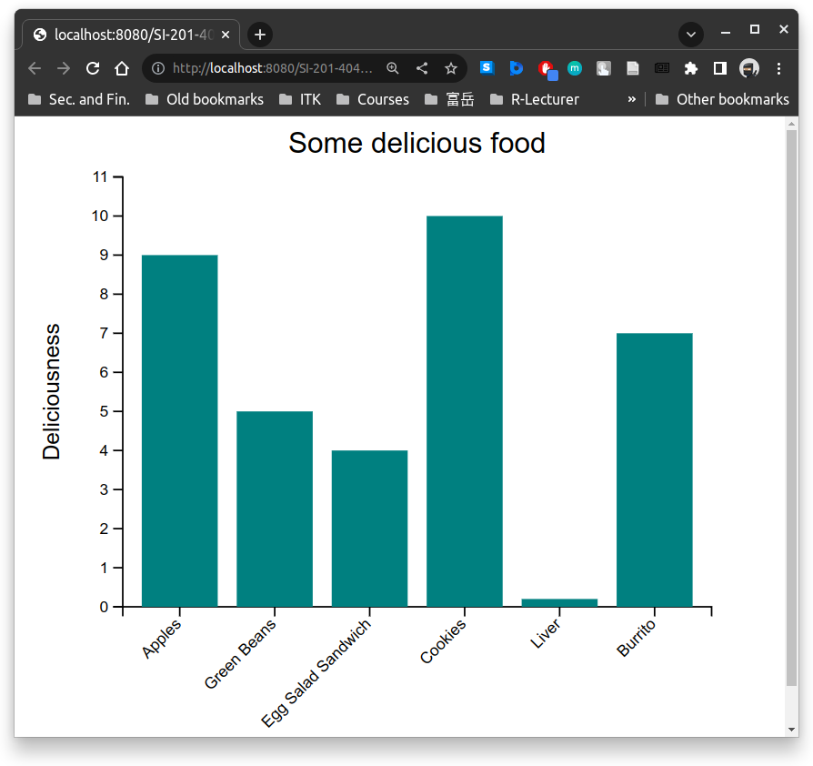

Mengingat kembali pertemuan sesi kelas, kita dapat juga
menggunakan JavaScript library Plotly. Kelebihan dari Plotly
adalah kita tidak perlu mendefinisikan banyak hal terkait
tata letak axes, bars, axes labels, dan titles. Dan kode
yang dituliskan juga tidak terlalu panjang seperti 
menggunakan d3.js. Namun yang menjadi nilai tambahan dari 
d3.js, kita mempunyai kebebasan untuk membuat plot dengan
bentuk apapun karena kita memiliki kebebasan untuk 
mengatur secara rinci peletakan setiap elemen dalam plot
Bar Chart. Pada akhirnya semua dikembalikan kepada pengembang
manakah yang lebih utama kecepatan produksi visualisasi
atau mengutakaman visualisasi yang orisinal sesuai 
kebutuhan pengembang.

Jika ingin mempelajari lebih dalam dan tidak ingin membuat
dari awal, kita bisa mengunjungi laman berikut untuk 
menelusuri tata cara penggambaran grafik di 
[D3.js Graph Gallery](https://d3-graph-gallery.com/index.html)
yang dibuat oleh Holtz Yan.


## Making Balikpapan Administration District Map

Bagian ini adalah bagian terakhir dari tutorial mata kuliah
Pemrograman Terstrutkut. Disini kita mengambil contoh ini
dikarenakan keterbatasan internet di sesi praktikum untuk
melakukan deploy personal blog menggunakan Next.js.

Untuk itu dipilih alternatif yang sekiranya masih berguna
digunakan dalam tugas akhir ataupun final project yang lain.

Disini kita akan membuat plot batas administrasi kecamatan di 
kota Balikpapan, yang merupakan pusat kota bisnis dan industri
terbesar di pulai Kalimantan. Di akhir bagian ini kita
akan membuat gambar peta berikut:

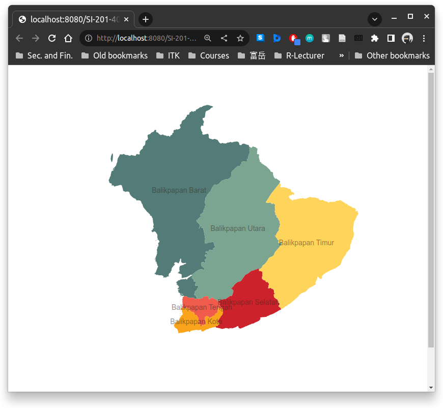

Pertama kita buat terlebih dahulu *working directory* sebagai berikut:

```
...
├─ d3-balikpapan-district-map/
│  ├─ main.html
│  ├─ plotd3.js
│  ╰─ styles.css
├─ datasets/
│  ╰─ balikpapan.geojson
├─ lib/
│  ╰─ d3.v7.min.js
...
```
Untuk data `balikpapan.geojson` dapat didownload 
[disini](./week-16-scripts/datasets/balikpapan.geojson).

Sama seperti pada bagian sebelumnya, kita buat terlebih dahulu
kerangka awal untuk program plotting map di `plotd3.js`.
(untuk isi `main.html` dam `styles.css` masih sama seperti sebelumnya).

Berikut kerangka awal untuk `plotd3.js`
**plotd3.js**
```js
let margin = { top: 30, right: 30, bottom: 100, left: 60 };
let width = 460 - margin.left - margin.right;
let height = 400 - margin.top - margin.bottom;

// Append the svg object to the body of the page
let svg = d3.select("body")
  .append("svg")
    .attr("width", width + margin.left + margin.right)
    .attr("height", height + margin.top + margin.bottom)
  .append("g")
    .attr("transform",
          "translate(" + margin.left + ", " + margin.top +")");


function plotMap(data) {
  console.log(data);
  console.log(document.querySelector("svg"));

}

d3.json("../datasets/balikpapan.geojson")
  .then(plotMap);
```

Sama seperti pada bagian sebelumnya di "Drawing with Data", 
kita menggunakan struktur yang sama yaitu mendeklarasikan 
terlebih dahulu HTML element untuk SVG berupa ukuran tinggi dan 
lebar dan ukuran margin atas, bawah, kanan dan kiri.

Berikutnya fungsi untuk menggambar peta kita namakan `plotMap()`
yang merupakan fungsi untuk melakan berbagai manipulasi data
sesuai dengan masukan yang disediakan oleh d3.js untuk menggambar peta.

Di baris terakhir merupakan pemanggilan data GeoJSON menggunakan
`d3.json()` yang menghasilkan suatu Promise object yang bisa kita sisipkan
suatu fungsi callback dalam contoh yang kita akan buat adalah fungsi `plotMap()`

Di dalam fungsi `plotMap()` kita masih menampilkan dua baris
perintah `console.log()` untuk melihat apakah data yang dibaca
sudah benar dan element SVG sudah dibuat dengan ukuran yang sesuai.
Berikut tampilan awal: 

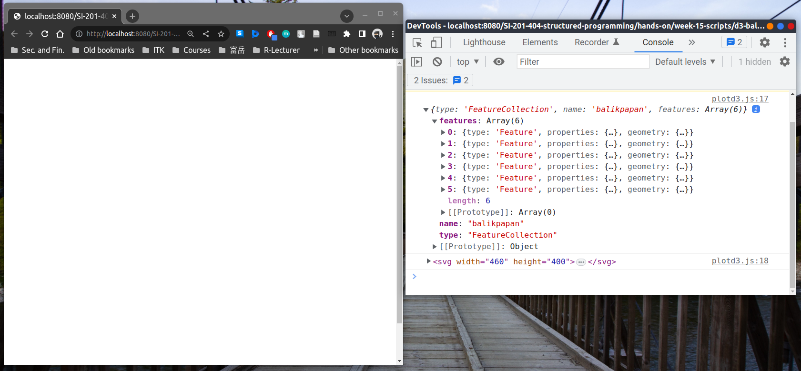

Web browser masih tidak menampilkan apa-apa, namun jendela console 
memberikan output yang kita inginkan yaitu enam wilayah kecamatan di balikpapan
dan SVG element dengan ukuran yang telah kita tentukan. 

Tahap berikutnya adalah melakukan beberapa transformasi koordinat data
dan transformasi koordinat peta ke SVG element `path`. Berikut adalah
tambahan baris kode JavaScript di dalam fungsi `plotMap()`

**plotd3.js**
```js
// Some lines above omitted

function plotMap(data) {
  // Some lines omited

  // Create a projection function (our data is in latitude, longitude)
  // This function is needed to project from spherical to cylindrical 
  let projection = d3.geoMercator().scale(1).translate([0, 0]).precision(0);
  console.log(projection);

  // Create a function to translate projected coordinate into SVG path
  let path = d3.geoPath().projection(projection);
  console.log(path); 
}

// Some lines omitted
```

Variabel yang pertama `projection` menyimpan fungsi transformasi untuk 
mengubah koordinat lintang dan bujur di dalam data `balikpapan.geojson` yang
kita miliki ke dalam koordinat silinder. Proyeksi ini dikenal
sebagai [Mercator projection](https://en.wikipedia.org/wiki/Mercator_projection).
(lihat di Wikipedia untuk lebih jelas).

Variabel yang kedua `path` adalah fungsi untuk melakukan transformasi
koordinat proyeksi ke dalam SVG element `path`. Fungsi transformasi ini
juga memerlukan inputan `projection`.

Dengan mencetak kedua fungsi transformasi itu ke jendela console, kita
bisa melihat bentuk fungsinya (mungkin penamaannya tidak jelas, karena
library d3.js sudah di-minifikasi untuk memperkecil ukuran file). 
Berikut output kedua fungsi transformasi di jendela console:

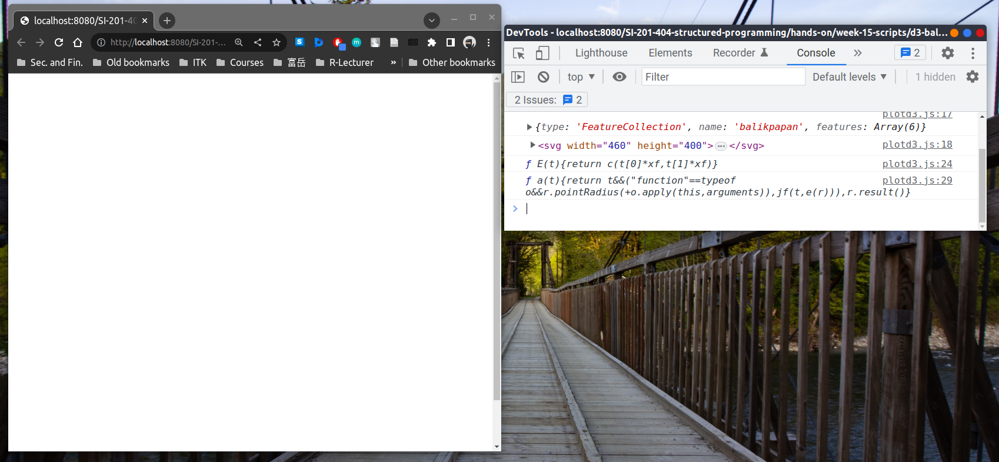

Tahap berikutnya melakukan scaling dan translation karena
ukuran path yang dihasilkan masih sangat kecil dan tidak sesuai
dengan ukuran SVG element yang telah kita tentukan di awal.
Untuk itu kita menggunakan rumus scaling dan translation ini
dari sumber berikut: ["D3 - Large GeoJSON File does not show draw map properly using projections"](https://stackoverflow.com/questions/23953366/d3-large-geojson-file-does-not-show-draw-map-properly-using-projections/24055015#24055015). Kode JavaScript berikut ditambahkan di dalam 
fungsi `plotMap()`

**plotd3.js**
```js
// Some lines above omitted

function plotMap(data) {
  // Some lines omitted

  // Automatic plot scaling and translation 
  let bounds = path.bounds(data);
  let scale = .95 / Math.max((bounds[1][0] - bounds[0][0]) / width, 
    (bounds[1][1] - bounds[0][1]) / height);
  let transl = [(width - scale * (bounds[1][0] + bounds[0][0])) / 2, 
    (height - scale * (bounds[1][1] + bounds[0][1])) / 2];
  console.log("bounds", bounds)
  console.log("scale", scale);
  console.log("transl",  transl);

  // Add scaling and translation to projection function
  projection.scale(scale).translate(transl);
}

// Some lines omitted
```

Kita dapat melihat hasil perhitungan scaling dan translation in 
di dalam jendela console.

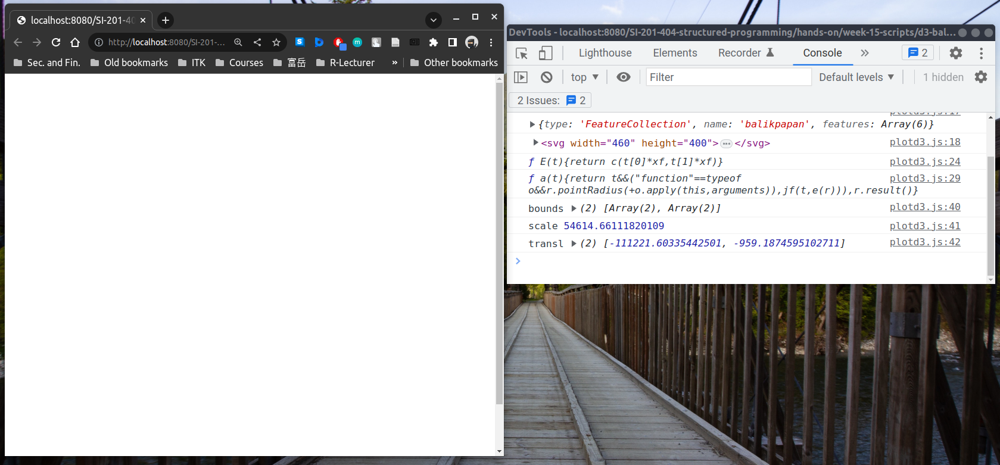

Selanjutnya adalah melakukan penggambaran tiap wilayah kecamatan
dan juga menambahkan attribute `class` di setiap SVG element path yang
mewakili wilayah kecamatan di kota Balikpapan.

**plotd3.js**
```js
// Some lines above omitted

function plotMap(data) {
  // Some lines omitted

  // Create polygon for district and give the element iits className
  // to be able doing styling using styles.css
  svg.selectAll(".subunit")
    .data(data.features).enter().append("path")
    .attr("class", (d) => "subunit " + d.properties.KEC_.replace(" ", ""))
    .attr("d", path);
}

// Some lines omitted
```

Pada baris kode JavaScript di atas, kita menambahkan class attribute
bernama "subunit " diikuti nama kecamatan, contoh "BalikpapanBarat".
Dari class attribute ini kita memiliki dua pilihan styling
yaitu dengan menggunakan className `subunit` untuk melakukan 
styling di seluruh wilayah kecamatan, atau secara specific
melakukan styling yang berbeda-beda di setiap wilayah kecamatan.
Dapat kita lihat pada bagian jendela Elements, terlihat 
di bagian SVG element `<path>` terdapat attribute tambahan
`<path class="subunit BalikpapanBarat">`

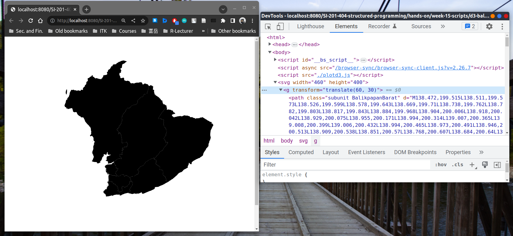
 
Gambar di atas menunjukkan semua wilayah masih berwarna hitam 
(warna default), sehingga kita perlu melakukan perwarnaan. Kita
dapat melakukan pewarnaan wilayah kecamatan langsung di dalam JavaScript.
Namun cara yang lebih elegan adalah menggunakan file `styles.css`
 
Disini kita akan melakukan pewarnaan wilayah yang berbeda beda untuk 
setiap wilayah kecamatan. Kita dapat melakukannya dengan menambahkan
perintah berikut di dalam file `styles.css`

**styles.css**
```css
/* Some lines omitted */

.subunit.BalikpapanBarat { fill: #537c78; }
.subunit.BalikpapanUtara { fill: #7ba591; }
.subunit.BalikpapanSelatan { fill: #cc222b; }
.subunit.BalikpapanTengah { fill: #f15b4c; }
.subunit.BalikpapanKota { fill: #faa41b; }
.subunit.BalikpapanTimur { fill: #ffd45b; }
```

Jika prosedur di atas dijalankan dengan benar, kita sudah dapat mencapai
hasil yang cukup memuaskan mendekati hasil akhir seperti berikut:

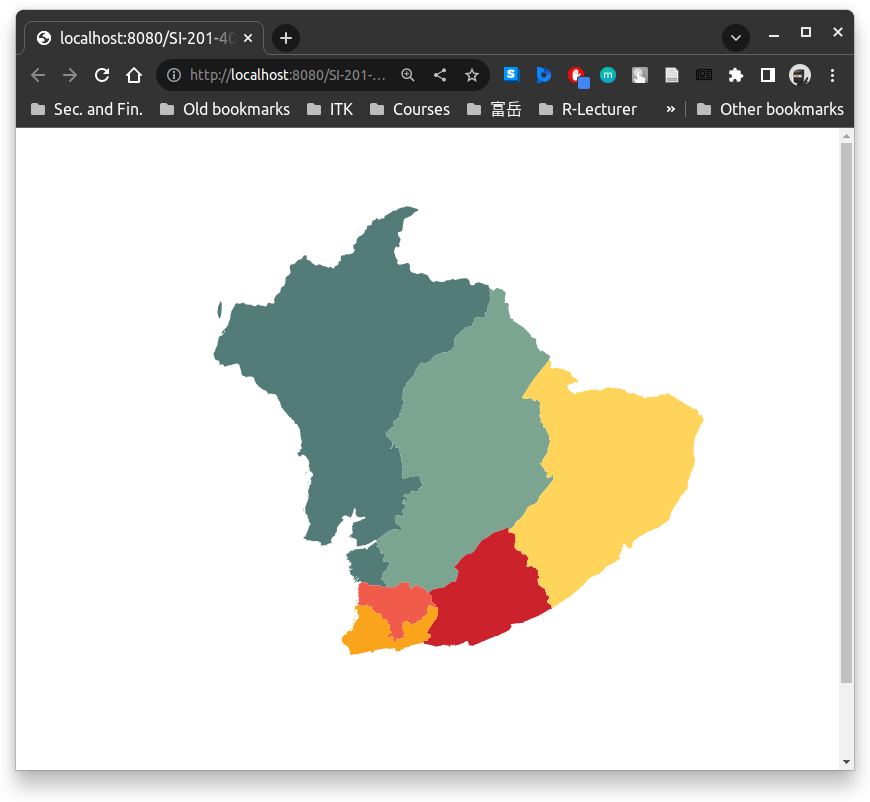


Langkah terakhir adalah menambahkan nama wilayah kecamatan. Disini kita
akan melakukannya secara otomatis dengan mengambil nama wilayah kecamatan
dari *property* `data.features[i].properties.KEC_` dengan `i` merupakan
indeks wilayah yang ada dalam data `balikpapan.geojson` dari 0 hingga 5 
(enam wilayah kecamatan). Berikut kita tambahkan kode JavaScript di dalam
fungsi `plotMap()`

**plotd3.js**
```js
// Some lines above omitted

function plotMap(data) {
  // Some lines omitted

  // Add labels for district name
  svg.selectAll(".subunit-label")
    .data(data.features)
    .enter().append("text")
    .attr("class", (d) => "subunit-label " + d.properties.KEC_.replace(" ", ""))
    .attr("transform", (d) => "translate(" + path.centroid(d) + ")")
    .attr("dy", ".35em")
    .text((d) => d.properties.KEC_ );
}

// Some lines omitted

```

Kemudian kita juga menambahkan sedikit styling untuk label nama wilayah 
kecamatan ini dengan menambahkan kode styling .css berikut di dalam `styles.css`

**styles.css**
```css
/* Some lines omitted */

.subunit-label {
  fill: #332519;
  fill-opacity: .5;
  font-size: 8px;
  font-weight: 300;
  text-anchor: middle;
}
```

Sehingga kita dapatkan hasil akhir seperti berikut:


Demikian tutorial sesi praktikum mata kuliah Pemrograman Terstuktur, semoga
dapat memberi manfaat untuk pembaca dalam melakukan eksplorasi dan pemanfaatan
JavaScript dalam menyelesaikan masalah sehari-hari. Perjalanan kita dalam
belajar JavaScript masih panjang.

Ada kemungkinan di tahun mendatang JavaScript akan terganti oleh bahasa
pemrograman lainnya. Namun pola umum dalam bahasa pemrograman seperti
fungsi, datatype, object, variable, dan hal-hal dasar lainnya akan terus
ada.

## Self-exercises

- Jelajahi dan carilah di internet terkait tata cara membuat
  file GeoJSON yang dapat di proses oleh d3.js.     
  *Hint*: 
  - Umumnya file peta memiliki format `.shp` yang
  merupakan file yang dihasilkan dari program standard untuk 
  melakukan pengelolalaan data-data GIS. 
  - File `.shp` biasanya
  dikumpulkan dengan file-file yang lain (tidak sendirian
  ada file penunjangnya berupa: `.shx`, `dbf`, `prj`).
  - Setiap file `.shp` selalu memiliki sistem referensi koordinat
  (CRS - Coordinate Reference System) yang mengatur titik data
  dengan titik bujur dan lintang. CRS untuk setiap file `.shp`
  umumnya tidak memiliki standard yang sama. 
  - Standar yang umum
  untuk CRS adalah EPSG:4326. Untuk itu perlu dilakukan transformasi
  koordinat dari file `.shp` ke EPSG:4326. 
  - Hal ini bisa ditempuh 
  dengan program CLI (Command Line Interface) `ogr2ogr`.
  - Lalu berikut dapat dilakukan konversi .shp yang sudah memiliki
  CRS EPSG:4236 menuju GeoJSON menggunakan program pengolah GIS
  seperti QGIS (gratis) atau ArcGIS (berbayar)

- Tambahkan fitur animasi, sehingga membuat peta yang digambar lebih 
  hidup. Sebagai contoh: ketika dilakukan *mouse hovering*, warna
  wilayah kecamatan berubah, atauy lebih besar dan muncul mendekati
  pembaca.