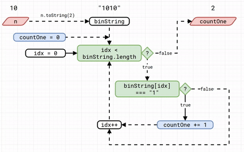

# Midterm Exam

Full Name: Henokh Lugo Hariyanto    
Student ID:  10241000    
Codewars alias: `lugoblogger`

## Day 01 (2025-April-22)

### 00-descending-order (7-kyū)

In this problem, we have a task to sort the digits for a given positive integer.
To solve this problem, first I turned the numbers into an array of digits
using spread operators 
```js
let digitArr = [...`${n}`];
```
where `n` is the input. The data type of each element in this array is a string.

After that, we use `.sort()` method from the array object, to sort
the digits alphabetically and in increasing order
```js
let sortedDigitArr = digitArr.sort();
```

Because the task is asked me to get the sequence of digits in decreasing order,
we can use `.reverse()` method, to reverse the order of the digits
```js
sortedDigitArr.reverse();
```
This method is in-place method. It means that we do not need to reassign the
result into a new array. The existing array `sortedDigitArr` will be updated.

Now, we join all digits to make a string with `.join()` method.
We also put the argument `""`, in `.join()` method to make sure, 
the elements are joined without any delimiter (in default, it used command)
```js
let descDigits = sortedDigitArr.join("");
```

Finally, turn the string back into an integer and return the results
```js
decsDigits = parseInt(descDigits);
return descDigits;
```

### 01-is-this-triangle (7-kyū)

In this task, we need to check if the three given sides are possible for
creating a triangle.
To create a triangle, we need all the lengths of the sides to be positive numbers
(greater than zero). And also from the problem, the triangle must have
an area greater than zero. This means when we add any of two sides, 
this sum must be greater than the length of the last side. Our condition 
for making a non-zero area triangle are
1. all the sides must be positive
2. sum of any two sides must be greater than the remaining side

Let us assume that in the beginning, we have a variable `status` of 
whether we can make a triangle or not for those given three sides.
We set it initially to be `false`.
```js
let status = false;
```

The first condition can be translated into JavaScript as
```js
if (a > 0 && b > 0 && c > 0) {
  status = true
}
```
this code will change`status` to be `true` 

The second condition can be translated into
```js
if ((a >= b + c) || (b >= a + c) || (c >= a + b)) {
  status = false
}
```
we use the negation of the second condition, because before this 
`if` block, we may have `status = true` if the first condition is met.

Finally, we return the variable `status`
```js
return status
```


### 02-bit-counting (6-kyū)
This problem is very simple. It just computes the number of `1`
in a digit representation of a given positive integer.
Here is a program flow 



First, it transforms the positive integer `n` into a binary string
with the command `n.toString(2)`. Then we start an iteration for each
string in `binString` to check if it is `"1"` or not. If it is `"1"`,  
we add `+1` to `countOne`. After we traverse all the elements in 
`binString`, we get our result of the number of ones in `countOne`.

## Day 02 (2025-April-23)

## Day 03 (2025-April-24)

## Day 04 (2025-April-25)

## Day 05 (2025-April-28)


## Day 06 (2025-April-29)

## Day 07 (2025-April-30)

## Day 08 (2025-May-01)

## Day 09 (2025-May-02)

## Day 10 (2025-May-05)