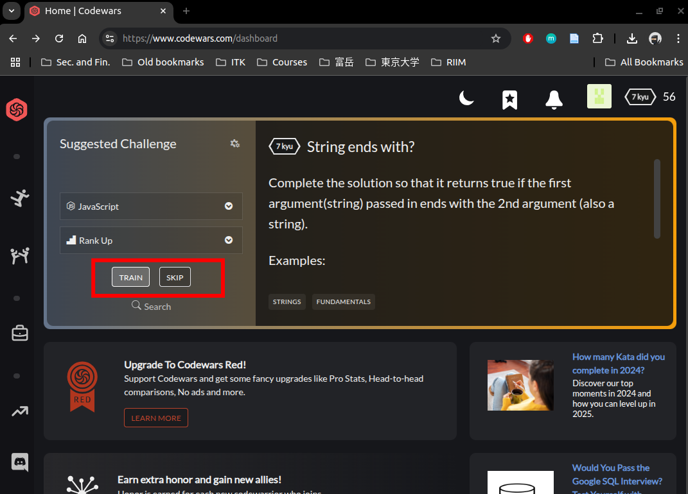

## Codewars short tutorial
1. After you have registered to the codewars and click "Home"
   button,

    

   you can search for the problem in the "Suggested Challenge" box.
   Choose "Fundamentals" or "Rank Up". If the problem is too
   difficult for you, you can skip it, by clicking "SKIP"
   or if you can do the problem, click "TRAIN"

   

2. After you click "TRAIN", it brings you to the code editor

   

   read the problem, and start type inside the function your solution
   to the problem in JavaScript codes. You do not need to rewrite the
   function

3. When you have finished type the solution, click "TEST" button 
   in the right bottom. It will give you the result of your solution

   

   If you passed the test, continue to click "ATTEMPT" to test
   all test cases (some of the test cases are hidden from the user).
   Finally, if you passed all the attempt, you can click "SUBMIT", your
   answer


## Advanced setup
If you want to test locally your solution, you can start by installing
the following assertion module `chai`

To install it, type the following command in the terminal.   
Make sure that you are in the same directory with `node_modules` or `package.json`
```
npm install --save-dev chai
```

Add `type: module` in `package.json`, to be able to use ES module
command
```js
import { assert } from "chai";
```